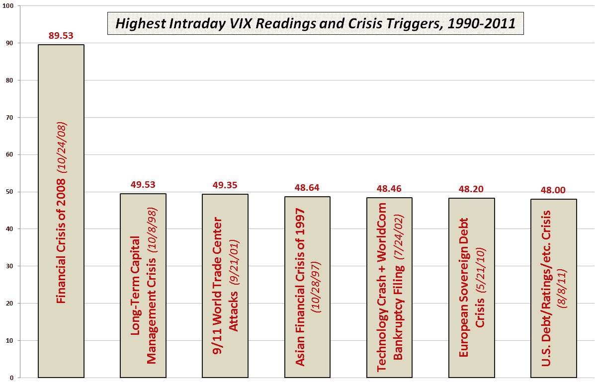

<!--yml
category: 未分类
date: 2024-05-18 16:49:09
-->

# VIX and More: VIX Sets Some New Records, Suggesting Volatility Near Peak

> 来源：[http://vixandmore.blogspot.com/2011/08/vix-sets-some-new-records-suggesting.html#0001-01-01](http://vixandmore.blogspot.com/2011/08/vix-sets-some-new-records-suggesting.html#0001-01-01)

Just a week ago the VIX seemed to be lagging behind the growing investor anxiety about fundamental challenges facing the stock market, but after Thursday’s drop of 4.78% in the S&P 500 index and today’s decline of 6.66%, the doubling of the VIX to 48.00 in one week seems right in line with investor fear.  *[Those wondering what a VIX of 48 means should consider that the literal translation is a prediction of a 3% or more change in SPX at least once every three days.  See [Rule of 16 and VIX of 40](http://vixandmore.blogspot.com/2010/05/rule-of-16-and-vix-of-40.html) for a more detailed discussion.]* 
As the chart below shows, a VIX of 48 only puts the current crisis at #7 all-time – or at least dating back through VIX data since 1990\. On a closing basis, today’s close was actually the highest closing VIX outside of the 2008-2009 financial crisis.

In studying my VIX data set, however, I was surprised to see that today the VIX set a number of new records. For instance, today marks the highest the VIX has ever closed relative to its 10-day, 20-day and 50-day simple moving averages. All three of these facts loom extremely large in terms of predicting future [mean reversion](http://vixandmore.blogspot.com/search/label/mean%20reversion) behavior. In fact, I publish a proprietary *VIX Mean Reversion Index* each Wednesday for the benefit of my [newsletter](http://vixandmore.blogspot.com/search/label/subscriber%20newsletter) subscribers and today marks the first time that index has maxed out at 100.

I also have my own proprietary calculations for VIX fair value. Today my model puts VIX fair value in the mid-37s, which confirms what the VIX Mean Reversion Index is saying.

Of course the VIX is certainly capable of continuing to defy gravity for an extended period going forward, but the odds favor a top in volatility very soon and quite possibly at 48.00.  Just in the time it took to create this post the Dow Jones Industrial Average futures have swung several hundred points, so it is unrealistic to expect volatility to come to a screeching halt.

Better yet, fasten your seatbelts tomorrow, but don’t be afraid to short volatility.

Related posts:

** ****Disclosure(s):*** *short VIX at time of writing**