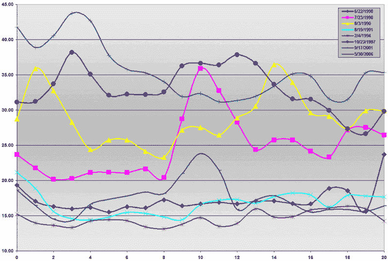
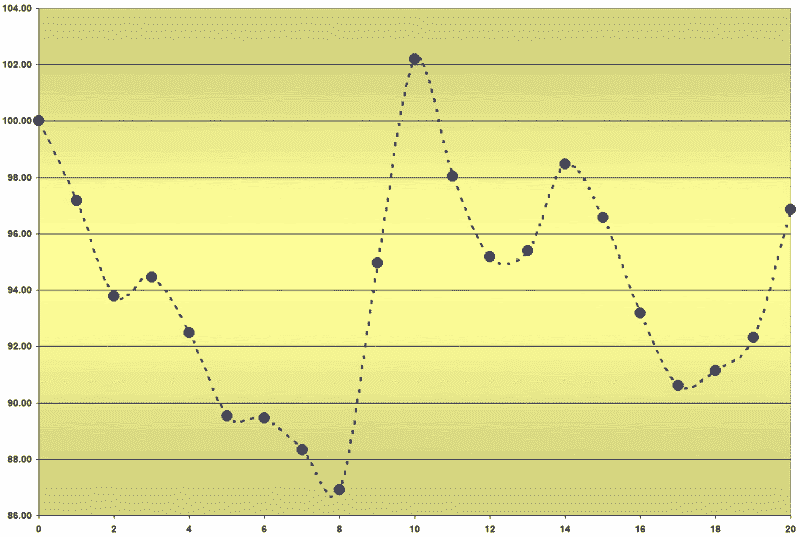

<!--yml
category: 未分类
date: 2024-05-18 15:56:43
-->

# VIX and More: VIX Spikes and Echo Volatility

> 来源：[http://vixandmore.blogspot.com/2007/03/vix-spikes-and-echo-volatility.html#0001-01-01](http://vixandmore.blogspot.com/2007/03/vix-spikes-and-echo-volatility.html#0001-01-01)

The action in the futures this morning might be giving us our first glimpse of *echo volatility* – something I talked about at length in “[What My Dog Can Tell Us About Volatility](http://vixandmore.blogspot.com/2007/01/what-my-dog-can-tell-us-about_947.html).”  Essentially, echo volatility is a term I use to describe the tendency for markets to be more susceptible to volatility spikes in the wake of an initial volatility spike.

Some of this phenomenon can be seen in the behavior of the VIX in the 20 days following the eight instances in which the VIX spiked at least 30% in one day.  In the graph below, day 0 is the VIX close on the day of the 30% spike.  In the 20 days that follow, you can see evidence of echo volatility twice looking three days out, another two times on days 9 and 10, once more on day 14, and again on day 20.  In sum, six of the eight 30% spikes showed evidence of at least one additional echo spike in the next 20 trading days.

With only eight data points, I am a long way from being able to say anything about [statistical significance](http://en.wikipedia.org/wiki/Statistical_significance), but if all market-related talking heads were to bite their tongue until they had something to say with a 95% confidence interval, let’s just say CNBC wouldn’t exist, nor would this blog or any of the blogs over to the right in the “Blogs I Read” section.

With that disclaimer out of the way, I decided to draw a composite picture of the 20 days following the eight instances of a 30% VIX spike.  The resulting graph, below, gives values normalized at 100% of the aggregate close on the day of the 30% spike and suggests that those who are long the market should expect to contend with at least one substantial echo volatility spike in the next month and possibly one that looks and feels as dramatic as the one on February 27^(th).

In the meantime, use stops and always have a plan for how to handle the next spike in your back pocket. Don't forget to pet your dog once in awhile too...