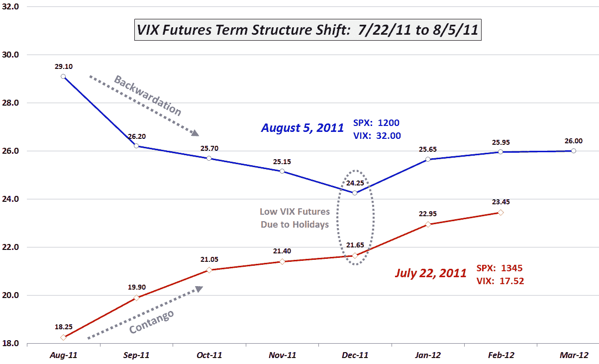

<!--yml
category: 未分类
date: 2024-05-18 16:49:22
-->

# VIX and More: VIX Term Structure Evolution Over Last Ten Days

> 来源：[http://vixandmore.blogspot.com/2011/08/vix-term-structure-evolution-over-last.html#0001-01-01](http://vixandmore.blogspot.com/2011/08/vix-term-structure-evolution-over-last.html#0001-01-01)

If you think the last two weeks have turned the investing world upside down, well you have to look no farther than the [VIX futures](http://vixandmore.blogspot.com/search/label/VIX%20futures) [term structure](http://vixandmore.blogspot.com/search/label/term%20structure) to see just how accurate that view is. Two weeks ago the VIX was in the 17s and the VIX futures term structure was in [contango](http://vixandmore.blogspot.com/search/label/contango) (upward sloping) and today the VIX closed at 32 and the VIX futures term structure is in [backwardation](http://vixandmore.blogspot.com/search/label/backwardation). In fact, the current VIX term structure looks a lot like a mirror image of what it was two weeks ago.

In the graphic below, I have detailed the shift in the term structure from July 22^(nd) to today’s close. During that period, the S&P 500 index has sold off 10.8%, while the VIX has spiked 82.6%. Note that the front month (August) VIX futures have advanced sharply – up 59% during this period – but not as sharply as the VIX. Looking at the back end of the term structure, the March 2012 futures were not traded back on July 22^(nd), so the February futures are the most distant futures for which we can compare prices. Their move lagged the VIX and front month futures by a large margin and was almost identical in magnitude to that of the SPX, up 10.7% in those two weeks. One can clearly see from the funnel formed by the two term structure lines that for each month farther out in the term structure, the VIX futures were less responsive to the move in the SPX or the VIX.

In addition to annotating the backwardation and contango in the graphic, I have also circled the December VIX futures and options expiration (December 21^(st)) in an effort to preempt some questions about why these futures seem unusually low both now and two weeks ago. The simple answer is the preponderance of holidays toward the end of the year, with fewer trading days translating into fewer opportunities for extended moves in volatility. I have discussed this phenomenon many times in the past (see [VIX and the Week Before Christmas](http://vixandmore.blogspot.com/2010/12/vix-and-second-half-of-december.html), for starters) and have named it the “[holiday effect](http://vixandmore.blogspot.com/search/label/Holiday%20Effect)” or “[calendar reversion](http://vixandmore.blogspot.com/search/label/calendar%20reversion).” Also note that December has a history of being relatively bullish for stocks, with low volatility.

Finally, I have fielded quite a few questions about the implications of yesterday’s 35.4% [VIX spike](http://vixandmore.blogspot.com/search/label/VIX%20spikes). Here some prior research on the [Short-Term and Long-Term Implications of the 30% VIX Spike](http://vixandmore.blogspot.com/2010/04/short-term-and-long-term-implications.html) will undoubtedly be of interest to most readers. The quick takeaway is that this event is bullish for stocks and bearish for volatility. I would expect to see more evidence of this fact beginning to kick in on Monday.

Related posts:

**** **[source: Interactive Brokers]*  ***Disclosure(s):*** *short VIX at time of writing****