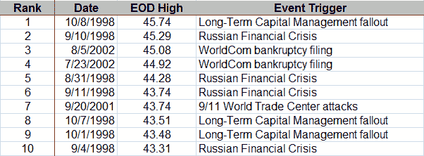

<!--yml
category: 未分类
date: 2024-05-18 18:24:27
-->

# VIX and More: VIX Top Ten Highest End of Day Closes

> 来源：[http://vixandmore.blogspot.com/2008/09/vix-top-ten-highest-end-of-day-closes.html#0001-01-01](http://vixandmore.blogspot.com/2008/09/vix-top-ten-highest-end-of-day-closes.html#0001-01-01)

In [Top Five VIX Spikes](http://vixandmore.blogspot.com/2008/09/top-five-vix-spikes.html) below, I have detailed the highest VIX values attained in an intra-day basis. In the table below, I offer up the ten highest end of day closes in the VIX. Regarding the “event trigger,” the dividing line between the Russian financial crisis and the problems associated with [Long-Term Capital Management](http://vixandmore.blogspot.com/search/label/Long%20Term%20Capital%20Management) is somewhat arbitrary. For the sake of simplicity, I am counting September 21, 1998 as the break point between the [Russian Financial Crisis](http://vixandmore.blogspot.com/search/label/Russian%20financial%20crisis) and public knowledge of the LTCM situation.

Note that end of day VIX calculations are made at 4:15 p.m. ET, so these numbers reflect a short stretch of after hours activity.

With an hour or so of trading left to go, the current 46.38 would be a new record close for the VIX.

