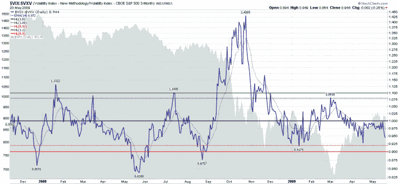

<!--yml
category: 未分类
date: 2024-05-18 17:46:39
-->

# VIX and More: VIX:VXV Ratio Moving Toward Bearish Zone

> 来源：[http://vixandmore.blogspot.com/2009/05/vixvxv-ratio-moving-toward-bearish-zone.html#0001-01-01](http://vixandmore.blogspot.com/2009/05/vixvxv-ratio-moving-toward-bearish-zone.html#0001-01-01)

Lately I have received quite a few requests to talk about the [VIX:VXV ratio](http://vixandmore.blogspot.com/search/label/VIX%3AVXV), something that I [first blogged about](http://vixandmore.blogspot.com/2007/12/vixvxv-ratio.html) back in December 2007, shortly after the [VXV](http://vixandmore.blogspot.com/search/label/VXV) volatility index was [launched](http://vixandmore.blogspot.com/2007/12/thinking-about-vxv.html).

The chart below is my standard VIX:VXV ratio chart and uses the 1.08 and 0.92 end of day closing levels as basic long and short signals. The last signal on the chart is a March 1^(st) long signal that preceded the March bottom by a week. On April 19^(th) the VIX:VXV ratio closed at .9276, but was below the 0.92 signal line on an intraday basis.

Yesterday, I saw some data that showed the VIX:VXV ratio below 0.92 during the trading session, but a review of the intraday chart tells me that while the VIX:VXV ratio was in the 0.9150 to 0.9200 area from about 9:50 a.m. to 10:10 p.m. ET, any lower numbers were likely to have been the result of bad prints.

For the record, while yesterday’s 0.944 close suggests a bearish bias, my reading of the ratio is that the preferred entry point for shorts positions would require waiting for a close of 0.92 or below.

*[Note that while this basic interpretation of the VIX:VXV ratio sets parameters for long and short entries, it does not include recommendations about exits or how to incorporate the VIX:VXV ratio into a trading system.]*

 *[source: StockCharts]*

***Disclosure****: Long VIX at time of writing.*