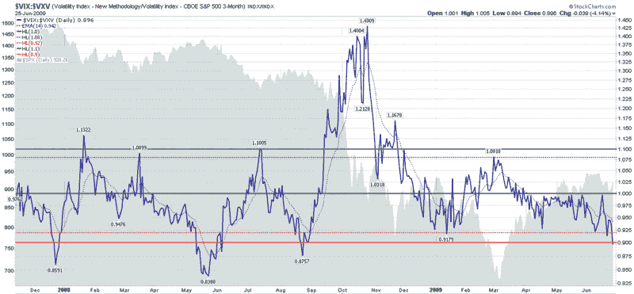

<!--yml
category: 未分类
date: 2024-05-18 17:41:23
-->

# VIX and More: VIX:VXV Ratio Sell/Short Signal

> 来源：[http://vixandmore.blogspot.com/2009/06/vixvxv-ratio-sellshort-signal.html#0001-01-01](http://vixandmore.blogspot.com/2009/06/vixvxv-ratio-sellshort-signal.html#0001-01-01)

The VIX closed at 26.36 today, down 15.4% from Monday’s close of 31.17 to the lowest closing level since the 25.66 close on September 12, 2008 – the last trading day before the Lehman Brothers bankruptcy was announced.

According to the classic 10 day simple moving average measure, which has the VIX currently sitting 11.7% below that level, the VIX is now in an ‘oversold’ position according to the [TradingMarkets 5% Rule](http://vixandmore.blogspot.com/2007/07/tradingmarkets-5-vix-rule.html) as well as a more stringent 10% threshold used by other traders.

From a volatility [term structure](http://vixandmore.blogspot.com/search/label/term%20structure) perspective, the VIX is also oversold. Notably, the [VIX:VXV ratio](http://vixandmore.blogspot.com/search/label/VIX%3AVXV), which compares 30-day volatility of SPX options to 93-day volatility (using the [VXV](http://vixandmore.blogspot.com/search/label/VXV) index), closed today at 0.896 today. In the chart below, you can see that when this ratio closes at 0.92 or below, the bears tend to have an upper hand for at least several weeks. When the ratio drops below 0.90, as was the case today, the odds shift even more favorably in the direction of the bears.

In brief, the low current levels in the VIX:VXV ratio suggest that options traders are too bullish and complacent in their 30 day outlook ([event volatility](http://vixandmore.blogspot.com/search/label/event%20volatility)) relative to their 93 day outlook ([structural volatility](http://vixandmore.blogspot.com/search/label/structural%20volatility).) While these two volatility measures can be brought back into line by lowering estimates of long-term structural volatility, the path of least resistance is for short-term event volatility to rise. This means the odds favor that the VIX will move in the direction of the VXV, which closed at 29.41 today. Of course rising volatility tends to favor the bears at the expense of the bulls. Even with today’s exceptionally strong close, longs should consider taking profits and/or initiating short positions.

*[source: StockCharts]*

***Disclosure****: Long VIX at time of writing.*