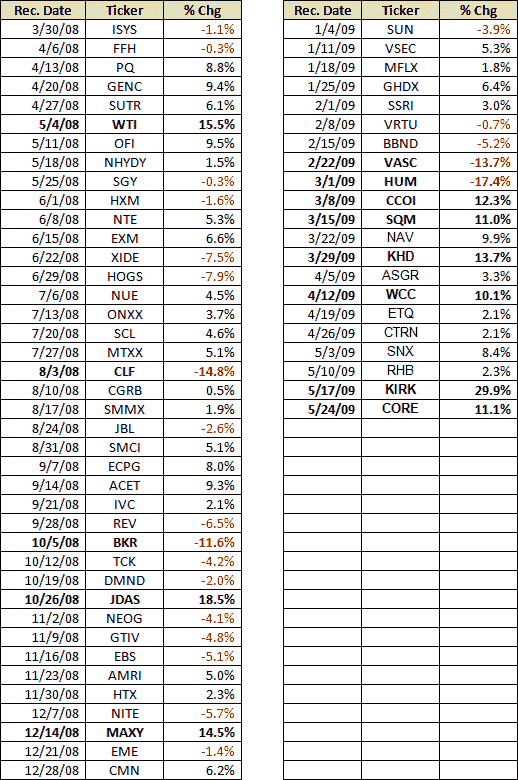

<!--yml
category: 未分类
date: 2024-05-18 17:45:47
-->

# VIX and More: VIX and More Stock of the Week Selection Up 343% in 14 Months

> 来源：[http://vixandmore.blogspot.com/2009/05/stock-of-week-selection-up-373-in-14.html#0001-01-01](http://vixandmore.blogspot.com/2009/05/stock-of-week-selection-up-373-in-14.html#0001-01-01)

When I launched the [*VIX and More* Subscriber Newsletter](http://vixandmore.blogspot.com/search/label/subscriber%20newsletter) in March 2008, I promised myself that I would reference the newsletter infrequently and continue to devote the majority of my time and effort to generate the type of charts and analysis that were not available elsewhere in the public domain.

Keeping church and state separate is not always an easy thing, but last month when a long-time friend and frequent visitor to the blog discovered that I had been publishing a newsletter for over a year without his knowledge, he expressed his surprise and some disappointment at my ability to keep the newsletter a secret.

In an effort to undo some of the secrecy, I thought I would highlight one of the weekly features of the newsletter which has become my wife’s favorite as well as the favorite of a number of readers. I call it my [Stock of the Week](http://vixandmore.blogspot.com/search/label/stock%20of%20the%20week) (SOTW) ‘Sequential Portfolio.’ Calling it a portfolio may be a bit of a stretch, because the self-imposed rules state that each week the entire portfolio is invested in a single stock that is purchased at the beginning of the week and sold at the end of the week, regardless of performance. I like to think of it as an equity relay race of sorts. If one stock stumbles or tires, there is always another one to take the baton just around the next turn.

The intent of the SOTW is to highlight a single stock each week, usually somewhat off of the beaten path, which I believe is worth owning for both fundamental and technical reasons. While all positions are long-only and are limited to one week, the purpose of the SOTW is not to encourage readers to hop on a single stock and ride it for a week, but rather to generate a new idea each week that might be a candidate for further investigation and perhaps an extended holding period.

The reason I decided to post about the Stock of the Week here and now is that the cumulative return for this long-only single stock portfolio is now +343.2% since I introduced the idea in my first subscriber newsletter some 14 months ago. During that period, the benchmark S&P 500 index is down some 31.7%.

Since the SOTW has reeled off eleven consecutive winning weeks and is already up 11.1% this week as a result of as a result of a big move today in this week’s selection, Core-Mark Holding Company ([CORE](http://vixandmore.blogspot.com/search/label/CORE)), I have henceforth decided to post the weekly selection after the first day of trading each week, as long as the winning streak continues.

For those who are interested, I have posted the entire history of the SOTW selections below.

Note that stock selection is not the primary focus of the newsletter. Instead, there are nine regular weekly features, as follows:

1.  The Week in Review: What Moved the Markets
2.  Market Commentary
3.  The Week Ahead: What to Look For
4.  Market Sentiment (using a proprietary Aggregate Market Sentiment Indicator)
5.  Volatility Corner (discusses the VIX and other volatility indices/products such as VXV, VXX, a proprietary Global Volatility Index, etc.)
6.  Asset Class Outlook (short, intermediate, and long-term outlook for ten asset classes)
7.  Current Investment Thesis
8.  VIX and More Focus Model Portfolios (Growth and Foreign Growth)
9.  Stock of the Week

For more information about the VIX and More Subscriber Newsletter and the 14 day free trial that I offer, check out the [VIX and More Subscriber Newsletter blog](http://vixandmoresubscriber.blogspot.com/).

*[source: VIX and More]*