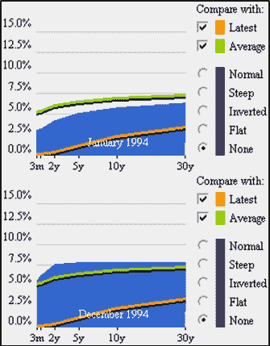

<!--yml
category: 未分类
date: 2024-05-18 16:15:34
-->

# VIX and More: VIX and SPX During the 1994 Interest Rate Hike Cycle

> 来源：[http://vixandmore.blogspot.com/2013/06/vix-and-spx-during-1994-interest-rate.html#0001-01-01](http://vixandmore.blogspot.com/2013/06/vix-and-spx-during-1994-interest-rate.html#0001-01-01)

With yesterday’s [The VIX and the Pre-FOMC + Post-FOMC Trades](http://vixandmore.blogspot.com/2013/06/the-vix-and-pre-fomc-post-fomc-trades.html) post in the books, it occurred to me that my reference to the series of interest rate hikes in [1994](http://vixandmore.blogspot.com/search/label/1994) probably stretches back before the memory banks of the current generation of investors. So with all the anxiety about Fed tapering and ultimately ending quantitative easing, I thought this might be a good time to review what happened to stocks and volatility when the Fed embarked upon a series of interest rate hikes that took the financial community by surprise.

To set the context, the 1990s started out with a recession that coincided with the first Gulf War and a corresponding sharp rise in oil prices. The Fed had been gradually lowering interest rates from 1989 – 1992 and this helped to create an environment that favored a recovery, but this recovery took some time to gain traction and did not get going until 1991\. The stock market fared better than the economy during this period; after a down year in 1990, stocks rallied to post gains in 1991, 1992 and 1993\. After a strong January for stocks, 1994 appeared to be on a similar path to success.

It was at this point that Federal Reserve Chairman Alan Greenspan decided to remove the proverbial punch bowl before the party got out of hand and on February 4, 1994, the Fed surprised the markets by announcing a 0.25% increase in the federal funds rate. By the time 1994 was over, the Fed had raised interest rates on six different occasions. As the chart below shows, the first three raises were 0.25% increases in the federal funds rate, but the incremental size of the raises increased to 0.50% and eventually 0.75% later in the year and were supplemented by increases in the federal discount rate, which also grew from 0.50% to 0.75%. By the time 1994 was in the books, the federal funds rate had jumped from 3.00% to 5.50% and the federal discount rate had risen from 3.00% to 4.75%. (The rate hike cycle finally ended on February 1, 1995, when the Fed raised the federal funds rate to 6.00% and the federal discount rate to 5.25%.)

Keep in mind that Alan Greenspan did not believe in signaling the Fed’s intentions in those days; on the contrary, he was a master of obfuscation and his cryptic and often ambiguous language typically kept investors in the dark about his intentions. For this reason, it was difficult for the markets to anticipate the Fed’s next move and investors we not necessarily prepared for subsequent interest rate hikes.

How did the financial markets respond to what amounted to almost a doubling of the federal funds rate and an increase of more than 50% in the federal discount rate? With a lot less volatility than one might imagine. The average closing value of the VIX was 13.93 in 1994, little different than the 13.90 average for the VIX in 2013\. While the VIX did spike all the way up to 28.30 on April 4^(th), the VIX only closed above 20.00 on two days during the entire year! The S&P 500 index ended the year with a small loss (a small gain if dividends were to be included in the calculations), but roared back with gains of 34%, 20%, 31%, 27% and 20% in the subsequent five years.

*[source(s): StockCharts.com, Federal Reserve Bank of New York, VIX and More]*

The series of rate hikes did dramatically change the [yield curve](http://vixandmore.blogspot.com/search/label/yield%20curve), as the chart below illustrates. The more dramatic moves were at the front end of the terms structure, with the curve essentially flat from two years through thirty years by the end of 1994.

*[source(s): Wall Street Journal / SmartMoney]*

So while Robin Harding’s [Fed Likely to Signal Tapering Move is Close](http://www.ft.com/intl/cms/s/0/1f6e6926-d75e-11e2-8279-00144feab7de.html) article in the Financial Times yesterday (and his subsequent tweet, “The Fed does not leak anything to any journalist to steer markets - especially during blackout”) may have given investors an opportunity for a dress rehearsal for the ultimate tapering, the historical record from 1994 suggests that tapering fears may be exaggerating how the QE end game will ultimately play out.

Related posts:

***Disclosure(s):*** *none*