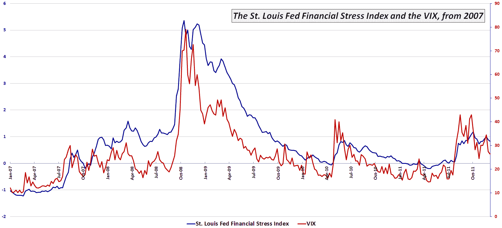

<!--yml
category: 未分类
date: 2024-05-18 16:45:33
-->

# VIX and More: VIX and St. Louis Fed’s Financial Stress Index Moving in Concert

> 来源：[http://vixandmore.blogspot.com/2011/12/vix-and-st-louis-feds-financial-stress.html#0001-01-01](http://vixandmore.blogspot.com/2011/12/vix-and-st-louis-feds-financial-stress.html#0001-01-01)

Last year I talked about the [St. Louis Fed’s Financial Stress Index](http://vixandmore.blogspot.com/2010/09/st-louis-feds-financial-stress-index.html) (which I am calling the [STLFSI](http://vixandmore.blogspot.com/search/label/STLFSI) in order to lower my carpal tunnel risk) as a measure of financial market risk that I consider complementary to the VIX and in some cases perhaps even a superior alternative.

Given the fact that some investors have difficulty coming to terms with the “[holiday effect](http://vixandmore.blogspot.com/search/label/Holiday%20Effect)” and the seasonal swoon in the VIX, I thought it might be timely to update a chart I have posted here [previously](http://vixandmore.blogspot.com/2010/09/zooming-in-on-st-louis-feds-financial.html) which captures the movements in the more broad-based STLSFI. Note that the chart dates from January 2007 and includes all the data from the financial meltdown of [2008](http://vixandmore.blogspot.com/search/label/2008), as well as the various permutations of the [European sovereign debt crisis](http://vixandmore.blogspot.com/search/label/European%20sovereign%20debt%20crisis) that have plagued the financial markets during the last two years or so. *[Data are through the last update to the STLFSI, 12/9/11.]*

Looking at some of the spikes in the chart, the first thing that strikes me is just how closely the two measures of risk have moved during the past five years. Also worth noting is the fact that both the VIX and the STLFSI indicate that the degree of risk/stress in the financial markets over the last few months has been slightly higher than what happened in one of the earlier Greek chapters of the euro zone debacle back in May and June of 2010.

More importantly perhaps, both the recent VIX and STLFSI data suggest that the current threats to the global financial markets are at least an order of magnitude lower than what we experienced in late 2008 and early 2009\. This is not to say that both the VIX and STLFSI cannot spike much higher in short order, only that according to both measures, we now appear to be on the downhill side of the crisis.

For more information on the components of the STLFSI and the index’s long-term performance, check out [St. Louis Fed’s Financial Stress Index](http://vixandmore.blogspot.com/2010/09/st-louis-feds-financial-stress-index.html).

Related posts:

 **

[source: Federal Reserve Bank of St. Louis]*  ***Disclosure(s):*** *none**