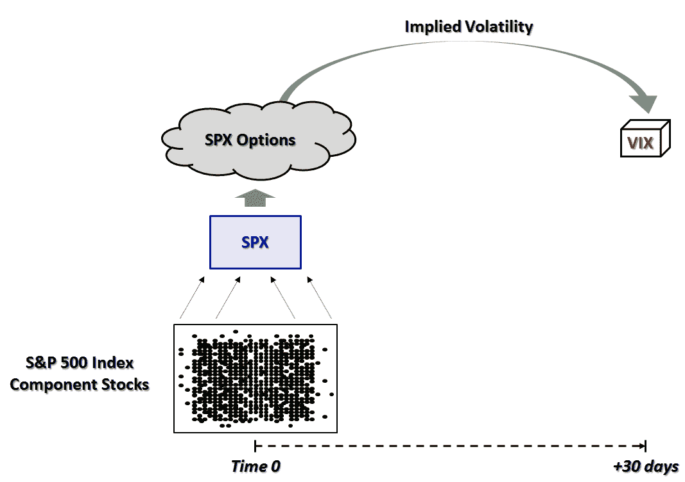

<!--yml
category: 未分类
date: 2024-05-18 17:00:11
-->

# VIX and More: VIX and VXX: In the Beginning…

> 来源：[http://vixandmore.blogspot.com/2010/10/vix-and-vxx-in-beginning.html#0001-01-01](http://vixandmore.blogspot.com/2010/10/vix-and-vxx-in-beginning.html#0001-01-01)

Last week in [What Do You Want to Know About VXX?](http://vixandmore.blogspot.com/2010/10/what-do-you-want-to-know-about-vxx.html) I asked readers for their thoughts on what to cover in what I anticipated would be a big kitchen sink post about the iPath S&P 500 VIX Short-Term Futures ETN ([VXX](http://vixandmore.blogspot.com/search/label/VXX).)

After reflecting upon the many thoughtful emails and comments I received, I realized that the scope of interest in and confusion about this product is sufficient to warrant a multi-part series. The more I thought about the broad spectrum of knowledge and lack of knowledge pertaining to VXX, the more I realized that it makes sense to start at the beginning to give investors of all experience levels as well as recent additions to the blog readership an opportunity to approach the subject with the same foundation of knowledge and context.

So…for the first time since launching this blog four years ago, I will start with the most basic question of all: what is the VIX?

The VIX, whose formal name is the CBOE Volatility Index, is a calculation made by the CBOE of market expectations of 30-day implied volatility for S&P 500 index options. The CBOE calculates and disseminates VIX values every 15 seconds during the *index* trading day, which runs from 9:30 a.m. to 4:**15** p.m. Eastern Time. In other words, the VIX is calculated during the normal NYSE trading day, plus 15 minutes after the close of normal trading.

With any luck, the graphic I created below simplifies the explanation of how the VIX is calculated.

The intent of the graphic is to demonstrate that out of the universe of all traded stocks, the VIX is concerned only with the stocks which comprise the S&P 500 index, also known by its ticker symbol, SPX. The S&P 500 index is maintained by an index committee (more details [here](http://www.standardandpoors.com/indices/sp-500/en/us/?indexId=spusa-500-usduf--p-us-l--)), with periodic changes to the index constituents. The VIX is calculated using near term SPX options (typically the first two months) and a wide range of strikes (see the [CBOE’s VIX white paper](http://www.cboe.com/micro/vix/vixwhite.pdf) for details on the calculation methodology) and essentially reflects the implied volatility of those options used in the calculations.

The result is the market’s estimate of implied volatility for the S&P 500 index for the next 30 days, stated in annualized terms. See [Rule of 16 and VIX of 40](http://vixandmore.blogspot.com/2010/05/rule-of-16-and-vix-of-40.html) for a better sense of how standard deviations are factored into the VIX and how to interpret the VIX in terms of standard deviations.

In the next installment, I will make the jump from the VIX to VXX, but in order to do so, we will have to become familiar with [VIX futures](http://vixandmore.blogspot.com/search/label/VIX%20futures) as well.

For those who are interested in some additional reading, the links below are an excellent place to start, as are all the *VIX and More* posts tagged with the “[educational](http://vixandmore.blogspot.com/search/label/educational)” label.

Related posts:

*

***Disclosure(s):*** *short VXX at time of writing**