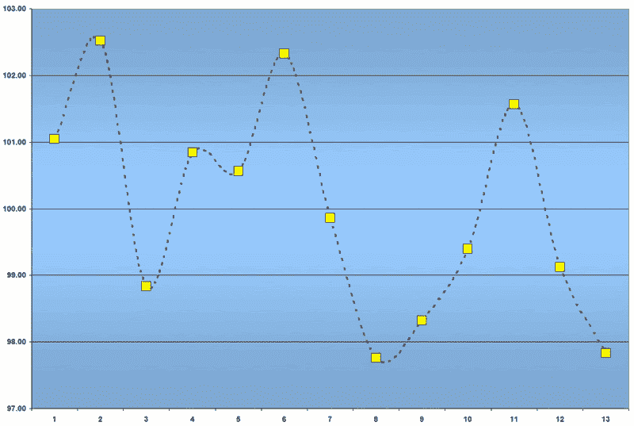

<!--yml
category: 未分类
date: 2024-05-18 16:01:16
-->

# VIX and More: VIX and the Quarterly Cycle

> 来源：[http://vixandmore.blogspot.com/2007/02/vix-and-quarterly-cycle.html#0001-01-01](http://vixandmore.blogspot.com/2007/02/vix-and-quarterly-cycle.html#0001-01-01)

I feel a little like a [Ginsu](http://en.wikipedia.org/wiki/Ginsu) knife, having sliced and diced the VIX: around [options expiration](http://vixandmore.blogspot.com/2007/01/vix-performance-during-options.html); around [Fed Days](http://vixandmore.blogspot.com/2007/01/vix-price-movement-around-fomc-meetings.html); and even from a [monthly](http://vixandmore.blogspot.com/2007/01/month-by-month-look-at-vix.html) seasonal perspective.

When I looked at the [earnings season](http://vixandmore.blogspot.com/2007/01/for-those-who-wonder-why-vix-options.html) movement in the VIX, I hypothesized that proximity to peak earnings season mattered much more than any influences of the options expiration cycle. I thought a relatively simple test of that theory might be to break down each quarterly cycle into 13 weeks and look at volatility over that 13 week period, keeping in mind that earnings reports for S&P 500 companies generally peak in the fourth and fifth week of each quarterly cycle, with the largest concentration of smaller caps reporting in the fifth week as well.

It turns out that a normalized chart of the 13 week quarterly cycle does not show much of a spike in the VIX leading up to earnings, nor does it show volatility subsiding in the back end of the quarter:

For now, we will leave it to the reader to draw their own conclusions, while we pick up the Ginsu and ponder other ways in which we might wish to julienne the VIX through space and time...