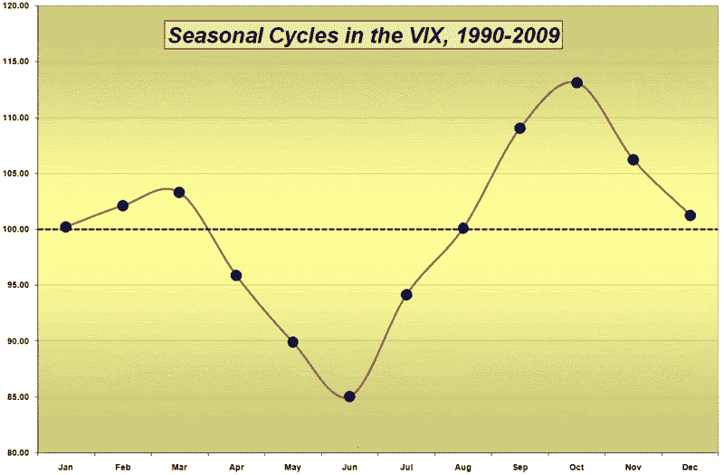

<!--yml
category: 未分类
date: 2024-05-18 17:41:59
-->

# VIX and More: VIX at Seasonal Cycle Low

> 来源：[http://vixandmore.blogspot.com/2009/06/vix-at-seasonal-cycle-low.html#0001-01-01](http://vixandmore.blogspot.com/2009/06/vix-at-seasonal-cycle-low.html#0001-01-01)

With the VIX now getting comfortable in the 20s, there has been a fair amount of discussion about just how low we can expect the VIX to go in the next few months.

Back in April, in [The New VIX Macro Cycle Picture](http://vixandmore.blogspot.com/2009/04/new-vix-macro-cycle-picture.html), I predicted that the VIX will likely not drop below the 25-27 area in the current bull market. That prediction has held up so far, but will almost certainly be tested during the summer months.

Most investors tend to think of the summer season as something of a [horse latitudes](http://en.wikipedia.org/wiki/Horse_latitudes) of sorts for trading, with volume tailing off, portfolio managers on vacation and stocks sometimes set to cruise control. As a result, most people equate summer with lower volatility.

While the VIX does tend to follow a distinct [seasonal cycle](http://vixandmore.blogspot.com/search/label/seasonality), the truth of the matter is that we are now at the seasonal cycle low, with volatility historically increasing dramatically from June through October. In fact, over the course of the past two decades the increase in volatility has been highest from June to July, increasing by over 10% (1.82 points.) The pattern is quite distinct in the chart below, which shows composite monthly volatility from January 1990 through last month, using 100 as the series mean.

So…while volatility may indeed trend lower as some of the concerns about the global recession are put to rest in the next few months, lower volatility will have to counter the established seasonal cycle.

For some previous posts on the same subject, try:

*[graphic: VIXandMore]* 

***Disclosure****: Neutral position in VIX via options at time of writing*