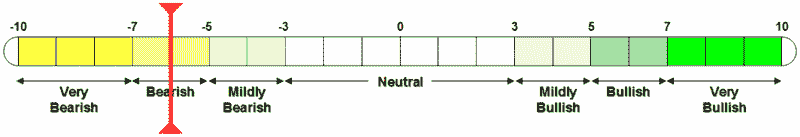

<!--yml
category: 未分类
date: 2024-05-18 18:56:18
-->

# VIX and More: VWSI Drops to -6 as Markets Ponder a U-Turn

> 来源：[http://vixandmore.blogspot.com/2007/10/vwsi-drops-to-6-as-markets-ponder-u.html#0001-01-01](http://vixandmore.blogspot.com/2007/10/vwsi-drops-to-6-as-markets-ponder-u.html#0001-01-01)

For four days last week, the VIX show hints of coming back to life and on Friday it roared back, posting a 24.1% gain, the third largest single day move since May 2006.  Friday’s VIX spike capped off a week in which the VIX gained 5.23 points, or 29.5%, to 22.96\. This also happens to be the VIX’s highest close in over a month.

From Monday through Thursday, the VWSI stuck stubbornly to a zero reading, but Friday’s action moved the indicator to -6, suggesting that the broader market indices may be oversold at this stage.

Just as I [was last week](http://vixandmore.blogspot.com/2007/10/vwsi-back-to-zero-was-that-bump.html), I am more bearish on the broader markets than the VWSI would suggest.  In my view, the relevant time frame for the bears has now been extended: instead of merely having to prove that a selloff was more than a one day wonder, now the task at hand is to string together two ugly weeks in a row in order to take the wind out of the bull’s sails.  Tomorrow is almost certain to open down as continued selling pressure from Friday carries over to the open.  The question is whether the selling can be sustained or if enough buyers will be brave enough to jump in to ease the selling pressure.  The second half of tomorrow’s session and all of Tuesday’s action – unhindered by government data, but still at the whim of corporate earnings – should have a great deal to say about how the rest of the week will go.  The bull market may be long in the tooth, but the bulls still have a good case for a continuation of the five year bull trend – at least for now.

 *(Note that in the above temperature gauge, the "bullish" and "bearish" labels apply to the VIX, not to the broader markets, which are usually negatively correlated with the VIX.)*

 *****Wine pairing:***  When the VWSI hits -6, you need a big wine to balance it out.  My recommendation is a zinfandel.  For those who may have missed it, in addition to *VIX and More*, I occasionally blog at *[Zin and Pinot](http://zinandpinot.blogspot.com/)*, a blog dedicated to my love of wine – and evidence that I am quite partial to zinfandel.  As this is the first time we have hit a VWSI of -6 since August 2006 – well before I began blogging about volatility and vineyards – I will refer the reader to a set of links to [eleven of my favorite zinfandel producers](http://zinandpinot.blogspot.com/) that I maintain on Zin and Pinot.

In the last week or two I have sampled several [zins from Hartford Family Winery](http://www.hartfordwines.com/wines/zinfandel/), including a 2003 Highwire Vineyard and a 2004 Dina’s Vineyard.  Alas, I am afraid I am down to my last bottle of the

2004 Fanucci-Wood RoadVineyard, which is probably my favorite of the <city st="on"><place st="on">Hartford</place></city> zins from the past few vintages.  The winemaker generally favors dense fruity wines from old vines of up to a century or more in age.  Expect a lot of alcohol here too, usually in the range of 16% (one in my cellar has 17.1% alcohol, according to the label) though you would be hard pressed to identify it amidst a silky smooth mouth feel.**