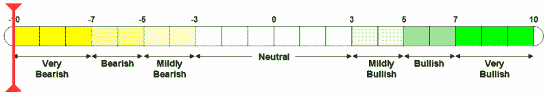

<!--yml
category: 未分类
date: 2024-05-18 15:56:18
-->

# VIX and More: VWSI at -10

> 来源：[http://vixandmore.blogspot.com/2007/03/vwsi-at-10.html#0001-01-01](http://vixandmore.blogspot.com/2007/03/vwsi-at-10.html#0001-01-01)

With the VIX Weekly Sentiment Indicator (VWSI) ending the week at -10 for the first time since 9/11, the prognosis for the VIX over the next month or so is as bearish as it has ever been.

The current extreme readings in the VWSI have only been approached on three previous weeks since 1990:

*   Following 9/11
*   In the wake of the Asian Financial Crisis and a 554 point decline in the Dow on 10/27/97
*   On the heels of a second Fed rate hike in consecutive months in March 1994, after a period of five years without any Fed rate hikes

In each of the three instances above, the broader markets were characterized by considerable turbulence and uncertainty for at least a year following the crisis.

As far as the VIX is concerned, if the history above is any guide, expect a sharp reversion to the mean.  The three previous -10 VWSI readings resulted in the following changes in the VIX:

*   3 days:  mean of -23% (-17%, -24%, -27%)
*   5 days:  mean of -32% (-27%, -33%, -36%)
*   10 days:  mean of -33% (-18%, -38%, -42%)
*   20 days:  mean of -43% (-37%, -46%, -47%)

As is the case with most VIX mean-reversion plays, most of the gains in these instances were limited to the first 20 trading days.

Keeping in mind the history above, there are many possible investment approaches if one expects history to repeat itself.  Being short volatility or short the VIX should be a central portion of that strategy.  [Neutral calendar spreads](http://www.theoptionsguide.com/neutral-calendar-spread.aspx) are a relatively conservative approach; [put back spreads](http://www.theoptionsguide.com/put-backspread.aspx) would be more appropriate for an aggressive investor.  Those wishing to strictly limit risk should probably also be looking at [iron butterfly](http://www.theoptionsguide.com/iron-butterfly.aspx) and [iron condor](http://www.theoptionsguide.com/iron-condor.aspx) strategies.

Finally, I would be remiss if I didn’t add that in periods of elevated volatility even more so than in more ‘normal’ markets, one should always plan exits before placing any trade and use stops wisely.  Better yet, if you are not used to trading options, this is not the time to start experimenting.

(Note that in the above temperature gauge, the "bullish" and "bearish" labels apply to the VIX, not to the broader markets, which are usually negatively correlated with the VIX.)