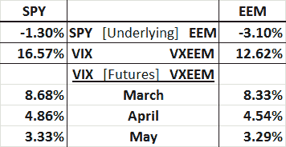

<!--yml
category: 未分类
date: 2024-05-18 16:36:58
-->

# VIX and More: VXEEM vs. VIX Indices and Futures in Today’s Selloff

> 来源：[http://vixandmore.blogspot.com/2012/03/vxeem-vs-vix-indices-and-futures-in.html#0001-01-01](http://vixandmore.blogspot.com/2012/03/vxeem-vs-vix-indices-and-futures-in.html#0001-01-01)

Stocks have been eerily quiet for the first ten weeks of 2012, with only four 1% moves in the SPX so far – and all of those coming to the upside.

It just so happens that the CBOE’s launch of futures and options on the CBOE Emerging Markets ETF Volatility Index ([VXEEM](http://vixandmore.blogspot.com/search/label/VXEEM)) coincided with this period of languid volatility, which has made it easier for this index to fly under the radar.

Today is the first time I am able to get data on the [VXEEM futures](http://vixandmore.blogspot.com/search/label/VXEEM%20futures) in a market that is down at least 1% and I must admit to being somewhat surprised by the results.

The table below captures SPY and VIX data in the left column along with and [EEM](http://vixandmore.blogspot.com/search/label/EEM) and VXEEM data in the right column. Note that approximately one hour into today’s regular trading session, SPY was down about 1.3% and EEM, the popular [emerging markets](http://vixandmore.blogspot.com/search/label/emerging%20markets) ETF, was down 3.1%. So far, so good. Far more interesting, while EEM was down about 2.4 times as much as SPY, the VIX was up substantially more than the VXEEM index, 16.57% to 12.62%...so while the selloff was disproportionately in emerging markets, the panic was disproportionately in the S&P 500 index.

I also captured simultaneous futures data for March, April and May for both the [VIX futures](http://vixandmore.blogspot.com/search/label/VIX%20futures) and VXEEM futures. Interestingly enough, the changes in the front three month futures for both the VIX and VXEEM were almost identical.

So what kind of volatility environment do we live in where the emerging markets index falls faster than the SPX (even beta-adjusted, but that discussion is for another day), while the VIX spikes much more than VXEEM, yet the futures for both products seem to move in almost identical fashion?

If you think you have the answer, pairs trading opportunities with VIX products and the VXEEM futures and options (there are no ETPs yet that are based on VXEEM) are certainly there for the taking. While VXEEM futures and options are not particularly liquid or deep yet, they are sufficiently liquid and deep from which to extract some profits.

Related posts:

**

*[source(s): Interactive Brokers]*

 ****Disclosure(s):*** *long EEM at time of writing;the CBOE is an advertiser on VIX and More**