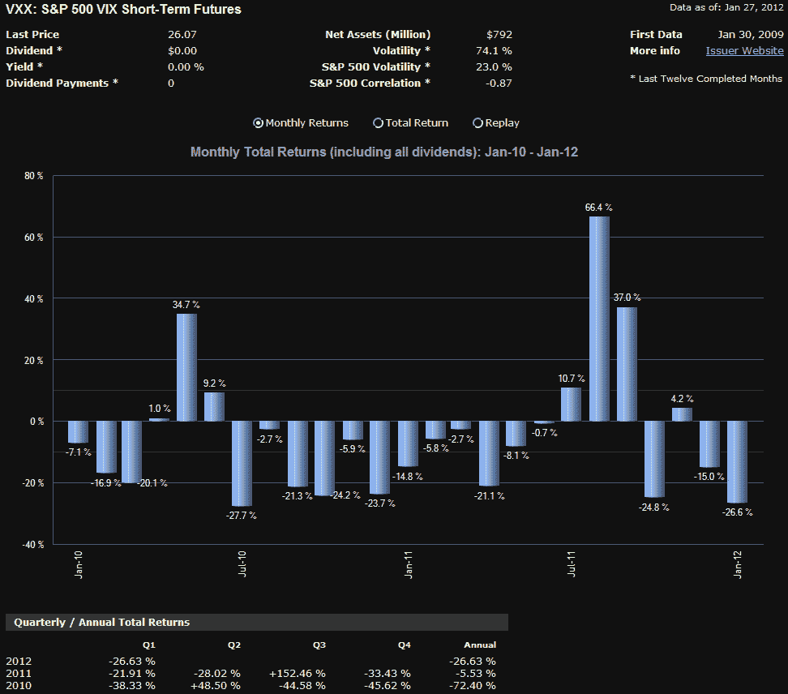

<!--yml
category: 未分类
date: 2024-05-18 16:42:15
-->

# VIX and More: VXX Celebrates Third Birthday

> 来源：[http://vixandmore.blogspot.com/2012/01/vxx-celebrates-third-birthday.html#0001-01-01](http://vixandmore.blogspot.com/2012/01/vxx-celebrates-third-birthday.html#0001-01-01)

It does not seem too long ago that I was the only person who thought [VXX](http://vixandmore.blogspot.com/search/label/VXX) was worth mentioning.

Known formally as the iPath S&P 500 VIX Short-Term Futures ETN, VXX was launched three years ago today, alongside of its sibling, the iPath S&P 500 VIX Mid-Term Futures ETN, [VXZ](http://vixandmore.blogspot.com/search/label/VXZ). Together these were the first VIX-based exchange traded product to be hit the market.

I have discussed in detail in this space the factors driving the performance of VXX ([VIX futures](http://vixandmore.blogspot.com/search/label/VIX%20futures), [contango](http://vixandmore.blogspot.com/search/label/contango), [roll yield](http://vixandmore.blogspot.com/search/label/roll%20yield), etc.) and the underlying causes of the persistent underperformance of VXX.

To bring the accounting up to date, VXX was down 68.4% in its first year, then lost 74.6% in its second year. During its third year of trading, VXX fared much better, but still managed to decline 18.6%. Of course there were pockets of excellent performance (notably a 66.4% jump in August, as the graphic below outlines), but over the course of a full year, the roll yield drag was more than the volatility spikes were able to overcome. In fact, VXX is now down 94% from its split-adjusted launch price.

Even with the above facts, it is still possible to trade VXX successfully from the long side, particularly if one keeps the holding periods as brief as possible and/or pays close attention to the VIX futures [term structure](http://vixandmore.blogspot.com/search/label/term%20structurehttp:/vixandmore.blogspot.com/search/label/term%20structure).

Related posts:

**

*[source(s): ETFreplay.com]*

 ****Disclosure(s):*** *short VXX at time of writing**