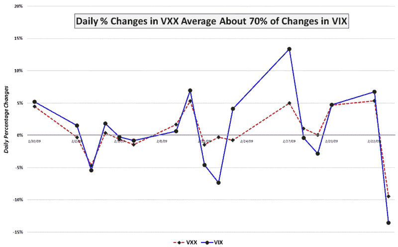

<!--yml
category: 未分类
date: 2024-05-18 17:58:06
-->

# VIX and More: VXX Juice Factor and Portfolio Insurance Implications

> 来源：[http://vixandmore.blogspot.com/2009/02/vxx-juice-factor-and-portfolio.html#0001-01-01](http://vixandmore.blogspot.com/2009/02/vxx-juice-factor-and-portfolio.html#0001-01-01)

While I continue to receive quite a few questions about [VXX](http://vixandmore.blogspot.com/search/label/VXX), the new the [VIX ETN](http://vixandmore.blogspot.com/search/label/VIX%20ETN), I note that volume seems to have settled into a pattern of approximately 100,000 shares per day. Perhaps the interest in this product is going to be more of an academic nature in the early stages, before trading and hedging strategies become better developed.

In any event, one of the key issues surrounding VXX has to do with what I call the [VXX juice factor](http://vixandmore.blogspot.com/search/label/VXX%20juice%20factor). In a nutshell, the question surrounds what sort of movement one can expect from a long VXX position relative to the VIX. Another way of looking at the same issue is to phrase the question in terms of how much VXX will move in one direction when the SPX moves in the opposite direction.

Last Friday, in [VXX Tracking VIX at 80+% Today](http://vixandmore.blogspot.com/2009/02/vxx-tracking-vix-at-80-today.html), I attempted to answer the first of these questions based on historical data. Today I will take a shot at both questions, using data from the first 17 days since the launch of VXX and with the aid of the graphic below.

In the first 17 days it has traded, I show VXX with a juice factor of just under 70%, meaning that, on average, for every 1% movement in the VIX, VXX has moved about 0.7%. Unfortunately, when the VIX makes a large move, this is the time when VXX typically has the smallest juice factor, as the divergences on February 12^(th) and February 17^(th) demonstrate.

At this stage, my working hypothesis is that VXX provides the most portfolio insurance when you don’t need it at all and is least effective when you need it the most.

I will address this issue in more detail going forward and bring some more data to bear on the subject.

*[source: VIXandMore]*