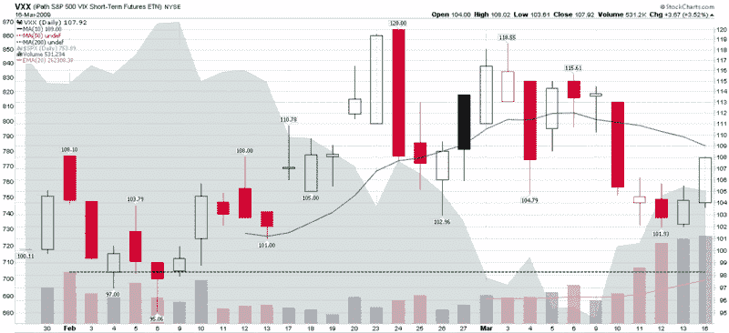

<!--yml
category: 未分类
date: 2024-05-18 17:55:11
-->

# VIX and More: VXX Sets New Volume Record for Fourth Consecutive Day

> 来源：[http://vixandmore.blogspot.com/2009/03/vxx-sets-new-volume-record-for-fourth.html#0001-01-01](http://vixandmore.blogspot.com/2009/03/vxx-sets-new-volume-record-for-fourth.html#0001-01-01)

When it was first launched, [VXX](http://vixandmore.blogspot.com/search/label/VXX), the short-term (one month) [VIX ETN](http://vixandmore.blogspot.com/search/label/VIX%20ETN), was an immediate success, at least as judged by the volume of trading, which exceeded 100,000 in each of the first eight sessions. Interest in VXX seemed to wane for awhile, then suddenly surged last Wednesday, as I reported in [VXX Sets New Volume Record](http://vixandmore.blogspot.com/2009/03/vxx-sets-new-volume-record.html).

Volume in VXX has only increased since last Wednesday. After today’s 531,234 share day, VXX now can claim four consecutive days of new volume records, surpassing the old record (dotted green line) that was established on the second day of trading.

Following last Wednesday’s record volume, I opined:

> *“I suspect that VXX trading volume will prove to be a meaningful sentiment indicator with the passage of time. Volume climaxes should provide some insight into the mindset of the retail trader and provide some contrarian signals at sentiment extremes.”*

I have no way of knowing whether the recent surge in volume is the result of bearish directional plays (i.e., bearish on stocks, bullish on volatility) on increased hedging activity. My hunch continues to be that the bulk of VXX trading is largely directional speculation and may provide to be a contrarian signal. They again, VXX traders may ultimately prove to be part of the smart money crowd.

I will keep an eye on this story and provide additional updates as appropriate.

*[source: StockCharts]*