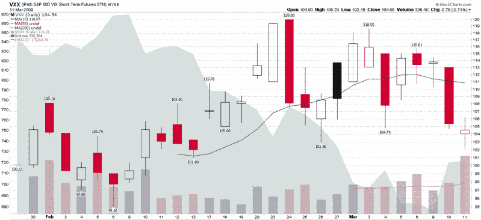

<!--yml
category: 未分类
date: 2024-05-18 17:56:00
-->

# VIX and More: VXX Sets New Volume Record

> 来源：[http://vixandmore.blogspot.com/2009/03/vxx-sets-new-volume-record.html#0001-01-01](http://vixandmore.blogspot.com/2009/03/vxx-sets-new-volume-record.html#0001-01-01)

[VXX](http://vixandmore.blogspot.com/search/label/VXX), the [VIX ETN](http://vixandmore.blogspot.com/search/label/VIX%20ETN) launched at the end of January, set a new volume record yesterday, with 336,384 shares traded. This breaks the previous record that was set on the second day of trading, back at the beginning of February.

Though it is too early to tell from the data, I suspect that VXX trading volume will prove to be a meaningful sentiment indicator with the passage of time. Volume climaxes should provide some insight into the mindset of the retail trader and provide some contrarian signals at sentiment extremes.

With all that said, I was a little surprised to see the new VXX volume record established yesterday. As the brokers I use do not allow VXX to be traded on margin and thus do not allow VXX to be sold short, I am led to conclude that yesterday’s volume record is most likely speculative activity on the part of those who think the hoopla over the recent mini-rally and talk of the death of volatility are premature.

Stay tuned for more on this subject going forward…

*[source: StockCharts]*