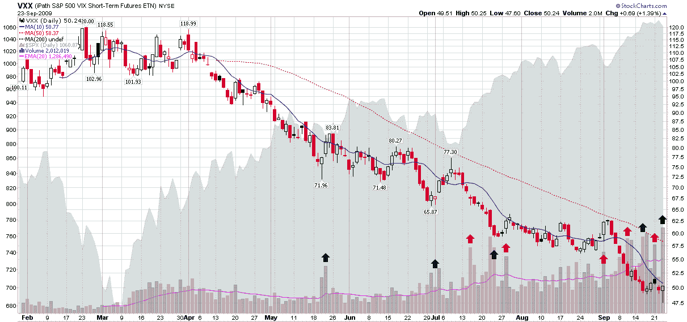

<!--yml
category: 未分类
date: 2024-05-18 17:28:38
-->

# VIX and More: VXX Surpasses Two Million Share Mark for First Time

> 来源：[http://vixandmore.blogspot.com/2009/09/vxx-surpasses-two-million-share-mark.html#0001-01-01](http://vixandmore.blogspot.com/2009/09/vxx-surpasses-two-million-share-mark.html#0001-01-01)

As the VIX sinks to a new 52 week low, the iPath S&P 500 VIX Short-Term Futures ETN ([VXX](http://vixandmore.blogspot.com/search/label/VXX)) appears to be catching on with investors who are looking to trade volatility directly without going the options route.

Trading volume in VXX topped the two million share level for the first time today, as investors began snapping up the ETN after it fell to an all-time (since the 1/30/09 launch) low of 47.60, then began rising as stocks sold off in the last 1 ½ hours of trading.

With only eight months of data, it is still too early to determine whether spikes in VXX volume represent the smart money or the dumb money, but the chart below is an attempt to lay out the facts so far. To simplify the interpretation a little, I have included a 50 day exponential moving average (EMA) of VXX volume as a purple line in the volume study. I have also highlighted nine of the most prominent volume spikes prior to today, with green arrows indicating where volume preceded a multi-day rise in VXX and red arrows indicating a bearish pattern that followed the volume spike.

Given that VXX has fallen steadily by 50% since its launch at the end of January, it has been a difficult task to time any spike in volatility. With a provisional ‘success’ rate of four out of nine bullish moves coming on the heels of volume spikes, it is also difficult to make the argument that VXX volume has been a sign of the smart money getting long volatility. The chart does show, however, that for a 2-3 day period following a volume spike, VXX is more likely to rise than when there is no volume spike.

Of course, until we get a significant spike in volatility, any conclusions about the predictive ability of VXX volume are going to have to be tentative ones.

For some additional reading on VXX, readers are encouraged to check out:

*[source: StockCharts]*