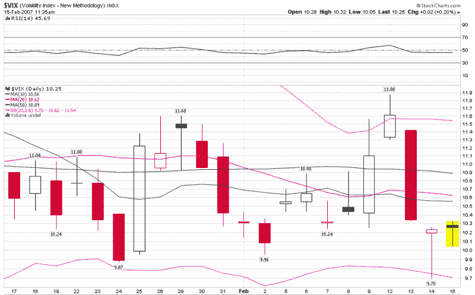

<!--yml
category: 未分类
date: 2024-05-18 15:59:13
-->

# VIX and More: Valentine’s Day Massacre: The Curse of Not-So-Random Roger?

> 来源：[http://vixandmore.blogspot.com/2007/02/valentines-day-massacre-curse-of-not-so.html#0001-01-01](http://vixandmore.blogspot.com/2007/02/valentines-day-massacre-curse-of-not-so.html#0001-01-01)

The [Lauriston Letter](http://lauristonletter.blogspot.com/index.html) (which can be counted on not just for high quality market commentary, but also for an unmatched sense of [complementary images](http://photos1.blogger.com/x/blogger2/4894/703358897143389/220/z/401383/gse_multipart20264.jpg)) pointed out an interesting [tidbit](http://lauristonletter.blogspot.com/2007/02/bears-are-in-some-skunk-funk.html) on Tuesday:

*“How often do you see volatility indexes move from the upper Bollinger band to the lower Bollinger band in one day?”*

The answer, of course, is almost never, but I decided to dredge my archives anyway in search of a reversal that best resembled the two day swing from above the upper band to below the lower band during February 12-14.

I tried to do for Excel what [datawink](http://datawink.com/) does for charts and caught very few fish – 11 over the past 17 years and only two during that past decade – that resembled the Valentine’s Day swing.  The combination of trying to locate CCI and %R reversals of such large proportions in just 48 hours proved too daunting of a hurdle to come up with anything close to an exact match.

Ironically, the two closest matches turned out to be the ones from the last decade: the three days ending on 11/3/04 and the three days ending on 7/11/05.  So I pulled up a bunch of charts to see if the VIX or SPX did anything of interest in the days or weeks that followed these two dates and came up empty.  If anything, the markets were considerably more quiet than usual in and around this period, and for the other nine VIX swing periods as well, which is consistent with [observations](http://traderfeed.blogspot.com/2006/09/how-much-opportunity-is-in-market.html) made by [Brett Steenbarger](http://traderfeed.blogspot.com/2006/09/how-much-opportunity-is-in-market.html) about the predictive ability of low volatility readings.  Perhaps these were just two random trees felled in a distant forest.

Undaunted, I decided to check the archives of some of the blogs that have archives going back to 2004 and made a stop at [Random Roger’s Big Picture](http://randomroger.blogspot.com/2004/10/deconstructing-vix.html).  This is where it starts to get interesting…

On Sunday, 10/31/04, Random Roger was [posting](http://randomroger.blogspot.com/2004/10/deconstructing-vix.html) about how Barron’s was “fixated on how low the VIX is.”  In fact, the VIX was at about 15 at the time and Roger was quick to point out that the then current 15-16 range was not low by historical standards.  The very next day, the VIX started an unprecedented high to low swing, moving from 16.76 to 13.79 in two days.

Eight months later, on July 6, 2005, Roger [dusted off his old post](http://randomroger.blogspot.com/2005/07/vix-revisited.html) and repeated his point that the VIX was still low by historical standards.  What happened next?  Even more dramatic fireworks, as the VIX pulled a stunning high-low swing from 13.92 to 10.53 in two days, resulting in the largest CCI (20) reversal since the inception of the VIX and confounding even [John Bollinger](http://www.bollingerbands.com/services/bcm/?type=money&mm=john) himself.

So those are the two precedents.  Is it merely a coincidence that not-so-Random Roger happened to warn about the VIX not being particularly low just before the largest VIX swings to the downside ever seen?  And where was Roger before the Valentine’s Day Massacre of 2007?  I have seen nothing on his blog that could lay blame at his feet, but would the VIX really have the temerity to make a move of this magnitude without his public approval beforehand?

I will watch this story closely and bring you any further developments…