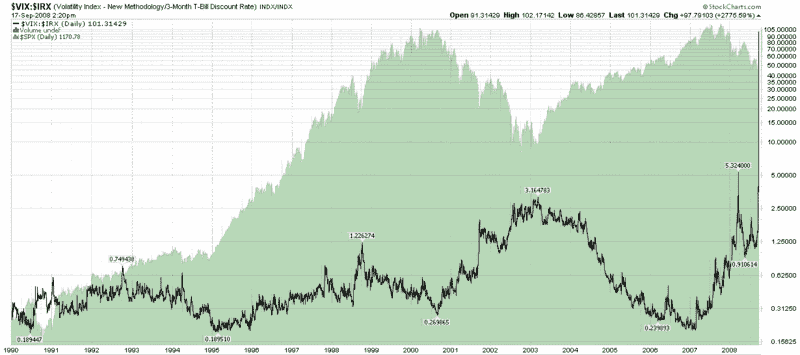

<!--yml
category: 未分类
date: 2024-05-18 18:26:09
-->

# VIX and More: Volatility Catastrophe Graphic

> 来源：[http://vixandmore.blogspot.com/2008/09/volatility-catastrophe-graphic.html#0001-01-01](http://vixandmore.blogspot.com/2008/09/volatility-catastrophe-graphic.html#0001-01-01)

[Catastrophe](http://www.merriam-webster.com/dictionary/catastrophe) may not be exactly the right word here, but I needed a title with which to introduce the graphic below, which is a ratio of the VIX to the [3 month T-bill](http://vixandmore.blogspot.com/search/label/3%20Month%20Treasury%20Bill) yield ([VIX:IRX ratio](http://vixandmore.blogspot.com/search/label/VIX%3AIRX)).

The chart goes back to beginning of the VIX data in 1990 and even in a log scale demonstrates that the current environment is several orders of magnitude more concerning (at least from a volatility and flight to safety perspective) than any other day in the last 19 years.

For more background on this particular ratio, check out [Expanding on the VIX and the 10 Year Treasury Note Yield](http://vixandmore.blogspot.com/2008/03/expanding-on-vix-and-10-year-treasury.html) and [Fear and the Flight to Safety](http://vixandmore.blogspot.com/2008/03/fear-and-flight-to-safety.html).

[source: StockCharts]