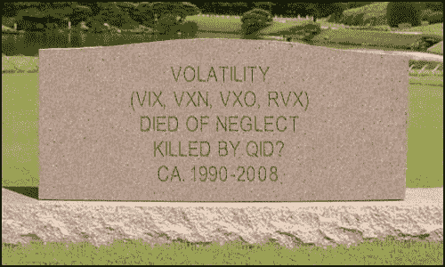

<!--yml
category: 未分类
date: 2024-05-18 18:47:04
-->

# VIX and More: Volatility RIP?

> 来源：[http://vixandmore.blogspot.com/2008/01/volatility-rip.html#0001-01-01](http://vixandmore.blogspot.com/2008/01/volatility-rip.html#0001-01-01)

I have talked rather extensively about the surprising lack of volatility in the markets during the past month or so, particularly given the sharpness of the current downturn and the preponderance of gloom and doom news out there.  For a little while, at least, it was possible to ignore this phenomenon and chalk it up to “[calendar reversion](http://vixandmore.blogspot.com/search/label/calendar%20reversion).”  Now that the holiday season is behind us, this explanation no long holds water and it seems everyone wants to know why the VIX just sits there in the low to mid-20s.

For those interested in the evolution of my thinking on this subject, I encourage your to consider reading [Not a Lot of Fear or Volatility Lately](http://vixandmore.blogspot.com/2007/11/not-lot-of-fear-or-volatility-lately.html) (11/27/07); [No Fear](http://vixandmore.blogspot.com/2007/12/no-fear.html) (12/19/07); [The Incredible Shrinking VIX](http://vixandmore.blogspot.com/2007/12/incredible-shrinking-vix.html) (12/21/07); [VIX Shrinkage Continues…](http://vixandmore.blogspot.com/2007/12/vix-shrinkage-continues-vwsi-at-6.html) (12/24/07); [The Low Fear Selloff](http://vixandmore.blogspot.com/2008/01/low-fear-selloff.html) (1/4/08); and [VWSI at Zero as VIX Meanders](http://vixandmore.blogspot.com/2008/01/vwsi-at-zero-as-vix-meanders.html) (1/14/08).

The bottom line is that I cannot explain why the volatility indices appear to be relatively indifferent to what many think is the beginning of a nasty bear market.  Of course, this relative complacency would be possible only if investors as a whole were not worried about a bear market – and when was the last time that investors failed to panic when the markets turned down sharply?

While I have no answers, per se, I do have a few working hypotheses that I tweak from time to time, in no particular order:

1.  increased use of inverse and double inverse ETFs (i.e., [QID](http://www.valueforum.com/ratings/rating.mpl?symbol=QID)) for hedging/speculation

2.  the expectation of a forthcoming emergency rate cut limiting upside potential for puts

3.  the possibility that there has been so much advance warning about a potential market meltdown that those who have wanted to protect their portfolio and/or speculate on a downside move have had ample time to do so, at their leisure

4.  a vicious cycle in which the less the VIX moves, the less valuable (reliable) it is as a hedge (or highly leveraged hedge)

If and when I can come up with a better answer to this question, I will cut in with a live feed from Volatility Central…