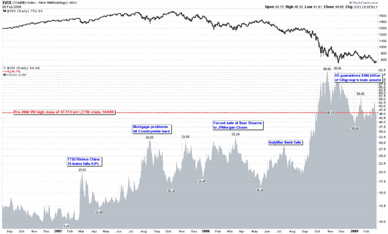

<!--yml
category: 未分类
date: 2024-05-18 17:57:48
-->

# VIX and More: Volatility Storm at Two Years and Counting…

> 来源：[http://vixandmore.blogspot.com/2009/02/volatility-storm-at-two-years-and.html#0001-01-01](http://vixandmore.blogspot.com/2009/02/volatility-storm-at-two-years-and.html#0001-01-01)

It was exactly two years ago today that the first winds of the volatility storm blew in from [China](http://vixandmore.blogspot.com/search/label/China). Back on [February 27](http://vixandmore.blogspot.com/search/label/February%2027), 2007, concerns about the Chinese government raising interest rates to discourage speculation helped to trigger an 8.8% loss in the Shanghai Composite Index and a 9.9% loss in the FTSE/Xinhua China 25 index that is the basis for the popular Chinese ETF, [FXI](http://vixandmore.blogspot.com/search/label/FXI).

In one of the earlier challenges to the decoupling theory, stocks around the world fell in sympathy, with the Dow Jones Industrial Average losing 416 points later that day to close at 12,216\. The simultaneous [64% spike](http://vixandmore.blogspot.com/2007/02/birthday-party.html) in the VIX still stands as a one day record, though two years later it seems a little quaint to talk about a massive [VIX spike](http://vixandmore.blogspot.com/search/label/VIX%20spikes) when the VIX failed to get out of the teens.

As the chart below shows, following the February VIX spike, the floor in the VIX jumped from 10.00 to 12.00 and that floor kept rising, first to 15, then 16, 18 and 22\. In fact, the pattern of higher lows continued for over a year.

In the StockCharts chart, I have elected to show volatility as an area chart to emphasize the rising tide aspect of volatility. Even though the May 2008 bottom prints as a lower low and the IndyMac Bank failure in July shows up as a lower high, this turned out to be the last glimpse of somewhat normal volatility before September 2008 unleashed the full force of the volatility storm. For easy reference and archival purposes, I have highlighted a handful of fundamental events that coincided with some of the important tops in the VIX in the past two years.

It has now been two full years and counting since the big drop in China and the first global volatility ripples, yet only a few hearty souls are willing to go out on a limb and predict that the worst is behind us.

Frankly, it think it is unlikely – though certainly not out of the realm of possibility – that we will see the VIX close over 80 again during the next decade, but then again two years ago no one was predicting that it would be so easy to keep the VIX above the 40 level for five full months.

This storm will eventually blow itself out, but the coastline will never look the same again.

*[source: StockCharts]*