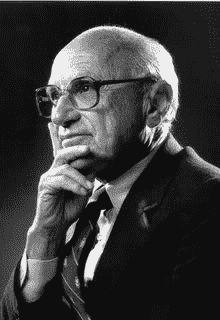
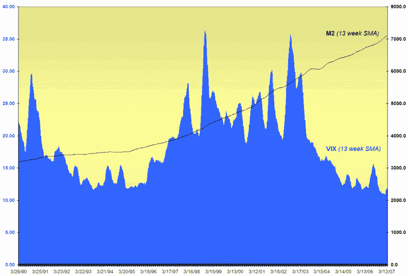

<!--yml
category: 未分类
date: 2024-05-18 15:50:24
-->

# VIX and More: Volatility and Liquidity: A First Look

> 来源：[http://vixandmore.blogspot.com/2007/04/volatility-and-liquidity-first-look.html#0001-01-01](http://vixandmore.blogspot.com/2007/04/volatility-and-liquidity-first-look.html#0001-01-01)

I must admit that when [Milton Friedman](http://en.wikipedia.org/wiki/Milton_Friedman) died last November, it was the first time that I stopped to think about the [money supply](http://en.wikipedia.org/wiki/Money_supply) in several years.  Of course, I hadn’t really given any thought at all to the VIX at that time and starting a blog was just about the furthest thing from my mind...

Fast forward five months and I find myself thinking about all three subjects.

Looking back, from July 2006 to [February 27^(th)](http://vixandmore.blogspot.com/search/label/February%2027) there was a constant drone about how global liquidity had all but snuffed out volatility; and with some [interesting comments](http://vixandmore.blogspot.com/2007/04/when-is-echo-volatility-safely-behind.html) cropping up on *VIX and More* this morning (thanks to 'F'), it seems like time I turned at least some attention to the subject, even if I do so with a substantial knowledge deficit.

Fortunately, Agustin Mackinlay has a [blog](http://www.liquidityblog.blogspot.com/) dedicated entirely to global liquidity issues and I have spent a little time in the past hour or two reading up on the [US money supply](http://www.newyorkfed.org/aboutthefed/fedpoint/fed49.html).  For those in need of a quick refresher on the money supply, [Wikipedia](http://en.wikipedia.org/wiki/Money_supply) has a good overview and Anna Schwartz has an excellent [article and links](http://www.econlib.org/library/Enc/MoneySupply.html). Quicken has a [Money Supply for Dummies](http://www.quicken.com/cms/viewers/article/investments/5271) quickie for those without ego issues and The [Ludwig von Mises](http://en.wikipedia.org/wiki/Ludwig_von_Mises) Institute has an [interesting perspective](http://www.mises.org/story/1956).

If you are not content with broad brush strokes and prefer a more in depth examination of some of the important money supply issues, I can recommend the following:

That’s should help with the background.

As for analysis, I pulled out my trusty Excel data and looked at [M2](http://www.economagic.com/em-cgi/charter.exe/fedstl/m2sl) and the VIX from 1990 to the present.  It doesn’t tell me much, but I include the graph here for those who may be interested.

With a little more maneuvering, I was able to get a VIX chart to match the 2003-2007 chart of the (reverse engineered) M3 money supply measure and have included it below.  More analysis is needed, but the eye can discern some sort of inverse correlation between M3 and the VIX during the past four years.

I will certainly return to this subject at some point in the future, but for now I encourage any lurking monetarists and others with thoughts on liquidity and volatility to chime in.