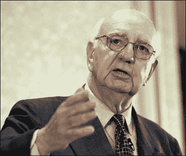

<!--yml
category: 未分类
date: 2024-05-18 18:44:55
-->

# VIX and More: Volcker Endorses Obama

> 来源：[http://vixandmore.blogspot.com/2008/02/volker-endorses-obama.html#0001-01-01](http://vixandmore.blogspot.com/2008/02/volker-endorses-obama.html#0001-01-01)

I do my best to keep politics out of this blog, but I thought it was particularly interesting that several days ago, former Federal Reserve Chairman [Paul Volcker](http://en.wikipedia.org/wiki/Paul_Volcker) announced that he was [endorsing Barack Obama](http://www.bloomberg.com/apps/news?pid=20601087&sid=aXl43P8d8T1s&refer=home). What baffles me and is the main reason I even bother to mention it in this space is [how little news play](http://news.google.com/news?q=paul+volcker+obama&ie=UTF-8&oe=utf-8&rls=org.mozilla:en-US:official&client=firefox-a&um=1&sa=N&tab=wn) this item has received.

Here we have probably the most important presidential election in a generation or more, with a semi-incumbent running whose husband just happens to be the only President to balance the budget in the past 35 years. Further, despite the war in Iraq, the economy is shaping up as a the key issue in the race and suddenly we have the most famous and revered Fed Chairman coming out in support of...the fresh face whose lack of experience is derided by critics.

I found the following quote from Volcker to be particularly telling:

> "It is only Barack Obama, in his person, in his ideas, in his ability to understand and to articulate both our needs and our hopes that provide the potential for strong and fresh leadership."