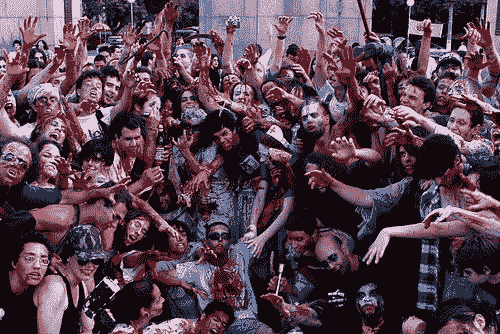

<!--yml
category: 未分类
date: 2024-05-18 18:04:43
-->

# VIX and More: Voodoo and Solvency, Krugman vs. Hempton

> 来源：[http://vixandmore.blogspot.com/2009/01/voodoo-and-solvency-krugman-vs-hempton.html#0001-01-01](http://vixandmore.blogspot.com/2009/01/voodoo-and-solvency-krugman-vs-hempton.html#0001-01-01)

 With talk of nationalization of European and American banks heating up, I want to make sure everyone had a chance to read Paul Krugman’s [Wall Street Voodoo](http://www.nytimes.com/2009/01/19/opinion/19krugman.html?_r=1&em) from Sunday’s New York Times. Krugman tackles the issue of so-called ‘[zombie banks](http://vixandmore.blogspot.com/search/label/zombie%20bank)’ that can still operate while technically insolvent and whose market capitalization, says Krugman, “is entirely based on the hope that shareholders will be rescued by a government bailout.”

Krugman lays out three policy alternatives for addressing these zombie banks:

1.  sufficient government funds to support the operation of the existing entity
2.  seizure of the bank by the FDIC with a transfer of toxic assets to a third party (a ‘bad bank’ or ‘aggregator bank’ along the lines of the Resolution Trust Corp. model), followed by the resale of the now solvent bank
3.  transfer of toxic assets to a third party, without prior government seizure of the bank

The concern Krugman has is that the Obama administration is leaning toward the third alternative, which rewards bank shareholders at the expense of taxpayers and perpetuates the moral hazard problem.

John Hempton offers up a challenge to the zombie bank solvency question in [Voodoo Maths and Dead Banks](http://brontecapital.blogspot.com/2009/01/voodoo-maths-and-dead-banks.html). Hempton claims that banks whose liabilities currently exceed assets can earn their way back to solvency if the net interest margin is sufficient to generate enough operating income to overcome the gap between liabilities and assets, hopefully in the span of a few years.

Hempton makes some excellent points and provides a philosophical foundation for much of the current approach. Given that there a lot of moving parts, the success of these efforts are ultimately going to be the result of several key factors, including:

*   the gap between liabilities and assets
*   the spread (net interest margin) banks will be able to realize going forward
*   the length of the economic contraction

From a government policy perspective, monetary policy will have a strong influence on bank spreads and fiscal policy will go a long way to determining the magnitude and length of the economic contraction.

Zombie banks can earn their way back to solvency in just the same manner that a homeowner who is underwater can continue to make mortgage payments until he or she crosses back into a positive equity situation in their home. The key for the banks is a healthy interest rate spread and a relatively brief recession that keeps loan losses from getting out of hand.

The problem with propping up zombie banks is that it may be too attractive of an alternative politically to prompt proper consideration of other options. Further, zombie banks will always look more attractive than they should due to the penchant for overly optimistic estimates of the gap between liabilities and assets as well as hopes morphing into beliefs that the economic downturn will be shorter than what the next pundit says.