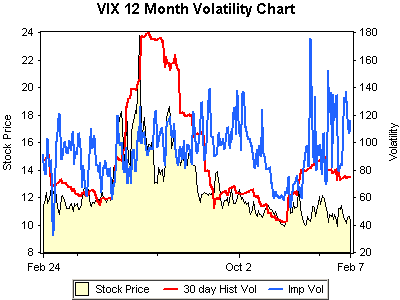

<!--yml
category: 未分类
date: 2024-05-18 16:00:04
-->

# VIX and More: Waiting for Godot

> 来源：[http://vixandmore.blogspot.com/2007/02/waiting-for-godot.html#0001-01-01](http://vixandmore.blogspot.com/2007/02/waiting-for-godot.html#0001-01-01)

As I wait for volatility to return to the markets, I have an almost [Waiting for Godot](http://samuel-beckett.net/Waiting_for_Godot_Part1.html#Top) feeling about what lies ahead.  At the moment, call me partly resigned and partly hopeful.

Fortunately, this is exactly where a bear call spread and call backspread can satisfy those two apparently conflicting views of volatility.  You have to ask yourself two main questions before considering which strategy is the better fit for your view of the market:

· What do you think is the likelihood of a significant increase in volatility?

· If a volatility spike happens, how severe will it be?

If you are of the opinion that a volatility spike is unlikely and/or will not be severe, then you should harvest some of the implied volatility in the VIX with a bear call spread.  This is a strategy that has been quite successful over the past 7 or so months, as Adam Warner at the [Daily Options Report](http://adamsoptions.blogspot.com/) has pointed out on several occasions.

On the other hand, if you think Godot might eventually show up carrying a large volatility spike, you are willing to forego some of the premium to position yourself to cash in on that spike, then the call backspread is a better way to play the VIX.  Of course, you can always buy the calls outright, but with VIX implied volatility currently at a very high level, you will have to paddle hard against the time decay current to make any progress.

For more information, [optionsXpress](https://www.optionsxpress.com/) (which generated the graphic on the left) has excellent discussions of the [bear call spread](http://www.optionsxpress.com/educate/strategies/bearcallspread.aspx) and the [call backspread](http://www.optionsxpress.com/educate/strategies/callbackspread.aspx).  [OptionPundit](http://www.optionpundit.net/) takes a deeper dive on both the bear call spread (aka [vertical credit spread](http://www.optionpundit.net/credit-spreads/what-is-credit-spread)) and on [call back spreads](http://www.optionpundit.net/options-essentials/backspread-startegy-for-large-moves).  These are both excellent resources for those whose options experience consists largely of buying calls and puts outright and selling covered calls – and who are open to more advanced options strategies.