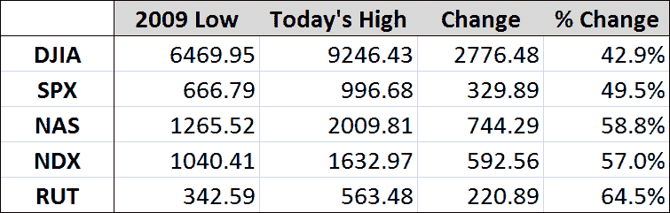

<!--yml
category: 未分类
date: 2024-05-18 17:36:08
-->

# VIX and More: Waiting for a Line in the Sand

> 来源：[http://vixandmore.blogspot.com/2009/07/waiting-for-line-in-sand.html#0001-01-01](http://vixandmore.blogspot.com/2009/07/waiting-for-line-in-sand.html#0001-01-01)

The rocket-fueled rally continues this morning, with today’s rally marked by very strong breadth and advancing volume ahead of declining volume by more than 10-1 as I write this.

Sooner or later, the bulls will run out of steam, the bears will get tired of retreating and we will have some semblance of a top. With SPX 1000 just around the corner, tomorrow the last trading day of the month and a number of overbought signals being pushed to extremes, today or tomorrow looks like a good place for any bears left alive to make their stand.

The chart below shows that since the March lows, five of the major indices have rallied from 43% (Dow Jones Industrial Average) to 64% (Russell 2000 small cap index).

In addition to being a nice round number and source of psychological support and resistance, SPX 1000 also marks exactly a 50% rally from the March bottom. If the bears cannot keep the SPX under 1010, then there is very little in the way of resistance on the way up to 1050.

I expect a line in the sand soon – and I expect it will have some staying power.

