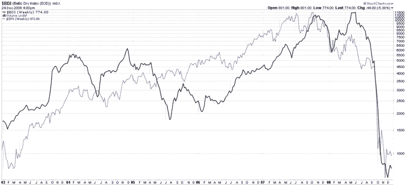

<!--yml
category: 未分类
date: 2024-05-18 18:08:24
-->

# VIX and More: Watch the Baltic Dry Index in 2009

> 来源：[http://vixandmore.blogspot.com/2008/12/watch-baltic-dry-index-in-2009.html#0001-01-01](http://vixandmore.blogspot.com/2008/12/watch-baltic-dry-index-in-2009.html#0001-01-01)

In 2009 investors will be scanning the globe for signs of economic recovery or deterioration. Among the many tools they should be watching in order to gauge the strength of global trade is the [Baltic Dry Index](http://en.wikipedia.org/wiki/Baltic_Dry_Index) (BDI.) The Baltic Dry Index measures shipping rates for [dry bulk carriers](http://en.wikipedia.org/wiki/Bulk_carrier) that carry [commodities](http://vixandmore.blogspot.com/search/label/commodities) such as coal, iron and other ores, cocoa, grains, phosphates, fertilizers, animal feeds, etc. In short, the BDI is an excellent proxy for global trade.

In the chart below, note how the BDI peaked after the S&P 500 index did in 2007 and bottomed after the SPX last month. The BDI may not be a leading indicator, but it is an important way to confirm whether moves in global equities are being reflected in an increase in global shipping. If the BDI fails to rally in 2009, be skeptical of any rally in stocks.

For those who are interested in following stocks of some of the leading dry bulk carriers, a good place to start is with Diana Shipping ([DSX](http://vixandmore.blogspot.com/search/label/DSX)), DryShips ([DRYS](http://vixandmore.blogspot.com/search/label/DRYS)), and Excel Maritime Carriers ([EXM](http://vixandmore.blogspot.com/search/label/EXM)).

*[source: StockCharts]*