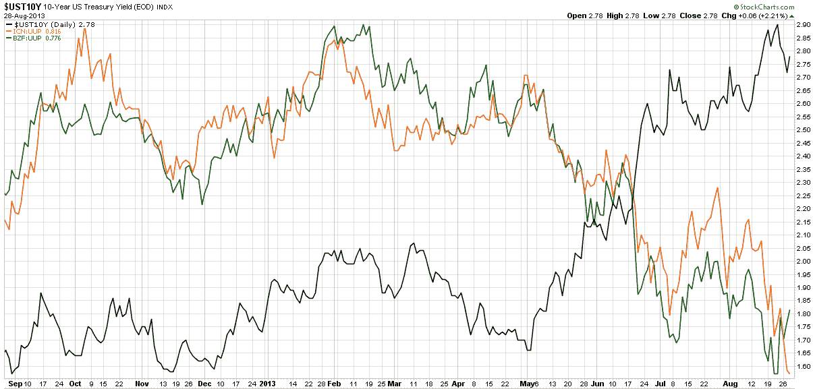

<!--yml
category: 未分类
date: 2024-05-18 16:13:39
-->

# VIX and More: Watching Two Key Emerging Markets Currencies

> 来源：[http://vixandmore.blogspot.com/2013/08/watching-two-key-emerging-markets.html#0001-01-01](http://vixandmore.blogspot.com/2013/08/watching-two-key-emerging-markets.html#0001-01-01)

With Syria and the Fed grabbing most of the headlines in the last few days, I wonder how many people have [emerging markets](http://vixandmore.blogspot.com/search/label/emerging%20markets) currencies at the top of their list of concerns. I am guessing few are poring over the likes of India ([EPI](http://vixandmore.blogspot.com/search/label/EPI)), Indonesia ([EIDO](http://vixandmore.blogspot.com/search/label/EIDO)), Brazil ([EWZ](http://vixandmore.blogspot.com/search/label/EWZ)), Turkey ([TUR](http://vixandmore.blogspot.com/search/label/TUR)), South Africa ([EZA](http://vixandmore.blogspot.com/search/label/EZA)), Thailand ([THD](http://vixandmore.blogspot.com/search/label/THD)) and the Philippines ([EPHE](http://vixandmore.blogspot.com/search/label/EPHE)) on a daily basis. As a matter of fact, I would bet that very few people even know that there is an ETF dedicated to the Philippines.

While keeping an eye on country-specific equities is important, it is currency movements that are at the heart of the emerging markets problem right now. Of course, the issue with currencies is really little more than a downstream effect of rising interest rates in the U.S., which is a result of changing expectations about the Fed’s quantitative easing (QE) program. Since December 2008, the Fed has used a variety of policy instruments to keep interest rates as low as possible in the U.S. and has effectively driven capital to emerging markets, where higher-yield investments looked more attractive. As QE begins to unwind, the supply of easy money in emerging markets has suddenly come to a halt and countries with large current account deficits and loans denominated in dollars (which will be repaid in a local currency that is rapidly declining in value) are particularly vulnerable.

Since many equity investors do not have access to a full menu of currency crosses, I think it is important to note that there are ETPs that track two of the most important emerging markets currencies:

*   WisdomTree Indian Rupee ETF ([ICN](http://vixandmore.blogspot.com/search/label/ICN))
*   WisdomTree Brazilian Real ETF ([BZF](http://vixandmore.blogspot.com/search/label/BZF))

In the chart below I show the yield in the 10-Year U.S. Treasury Note ([UST10Y](http://vixandmore.blogspot.com/search/label/UST10Y)) in the black line, along with a ratio of the Indian Rupee to the U.S. dollar (ICN:UUP) in orange, as well as a ratio of the Brazilian Real to the dollar (BZF:UUP) in green. Now these are a roll-your-own ratio of ETFs to ETFs rather than the exact currency crosses, but the charts are almost identical (and easily constructed at StockCharts.com), while the key takeaways are necessarily the same. Note that until May, ICN and BZF relative to the dollar appeared to be more positively correlated to U.S. interest rates than negatively correlated. As soon as interest rates began to rise at the beginning of May, both ICN and BZF began to rapidly lose ground against the dollar and the negative correlation with U.S. interest rates suddenly became very strong.

One last point worth noting is that the BZF:UUP ratio has seen a bounce during the course of the last week, while the ICN:UUP ratio continues to deteriorate, as there has been little to suggest that the Indian Rupee is stabilizing, even as Brazil improves somewhat.

*[source(s): StockCharts.com]*

For those who are interested in evaluating the risk and uncertainty in emerging markets in general, the recent [VEXXM as a Measure of Emerging Markets Volatility and Risk](http://vixandmore.blogspot.com/2013/06/vxeem-as-measure-of-emerging-markets.html) is recommended reading for some background and information on [VXEEM](http://vixandmore.blogspot.com/search/label/VXEEM), the CBOE Emerging Markets ETF Volatility Index.

Related posts:

***Disclosure(s):*** *long EWZ at time of writing*