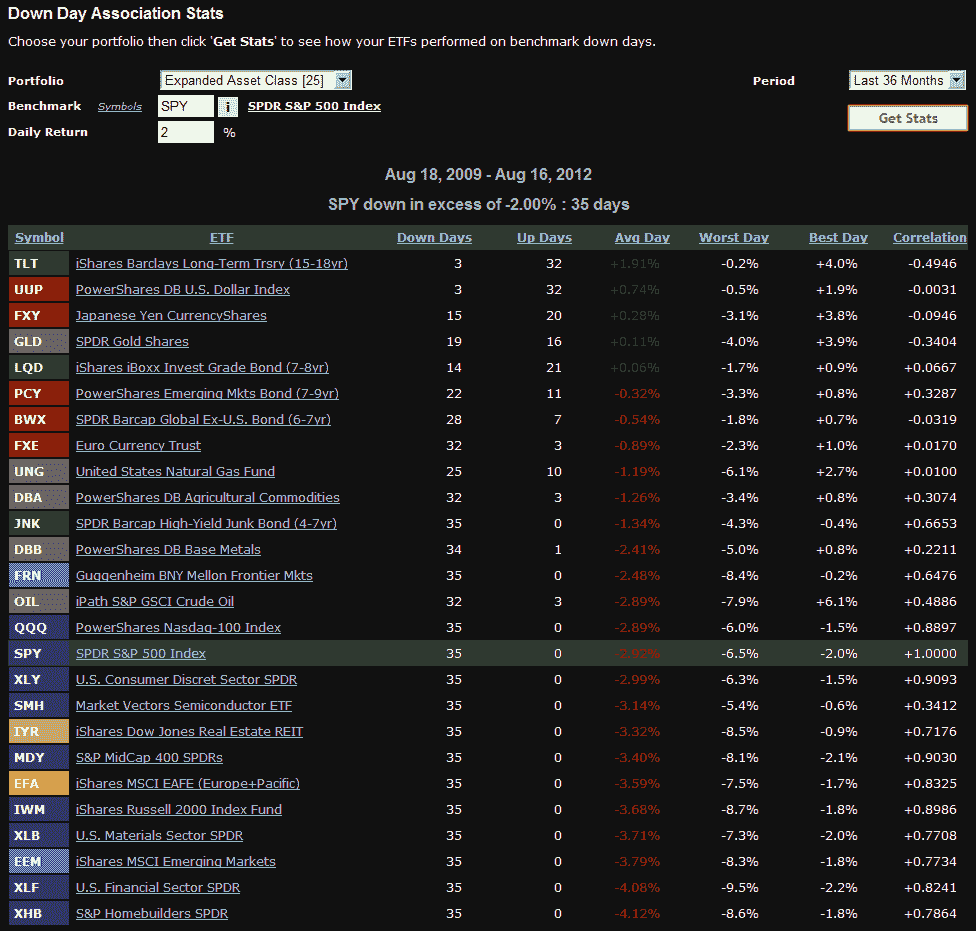

<!--yml
category: 未分类
date: 2024-05-18 16:25:24
-->

# VIX and More: What If Stocks Decline?

> 来源：[http://vixandmore.blogspot.com/2012/08/what-if-stocks-decline.html#0001-01-01](http://vixandmore.blogspot.com/2012/08/what-if-stocks-decline.html#0001-01-01)

Successful investors are the ones that are always making plans for all sorts of contingencies, so it stands to reason that they should even prepare themselves for the possibility of stocks actually declining one of these days...

I was thinking about the coming correction in stocks and how to position my portfolio for that moment when equities once again feel the effects of gravity when I stumbled upon an interesting tool at [ETFreplay.com](http://etfreplay.com/) that they call their Down Day Association Stats. In a nutshell, it looks at the performance of a group of user-specified exchange-traded products on those days in which a benchmark falls X%.

In the example below, I have chosen SPY as my benchmark, 2% (per day) as my threshold decline and 36 months as my lookback period. I looked at 25 ETPs that cover a wide range of [asset classes](http://vixandmore.blogspot.com/search/label/asset%20class) and investment approaches.

Some of the results from the Down Day Association Stats are not particularly surprising. For instance, the long bond ([TLT](http://vixandmore.blogspot.com/search/label/TLT)) and the dollar ([UUP](http://vixandmore.blogspot.com/search/label/UUP)) have a strong negative correlation to stocks and generally perform well when SPY declines sharply. Some of the other bond choices ([LQD](http://vixandmore.blogspot.com/search/label/LQD), [PCY](http://vixandmore.blogspot.com/search/label/PCY), [BWX](http://vixandmore.blogspot.com/search/label/BWX)) have been better at treading water than countertrending, but also show the benefits of diversification. The commodity choices were somewhat disappointing, generally managing to lose at best half as much as SPY, with crude oil almost matching the declines in the SPY to the penny.

Among the data points that surprised me were that the frontier ETF ([FRN](http://vixandmore.blogspot.com/search/label/FRN)) fared better than the SPY in big down days, while real estate ([IYR](http://vixandmore.blogspot.com/search/label/IYR)) fared worse.

Of course every decline in stocks has a different set of catalysts and puts different stresses on different asset classes, sectors and geographies, but as stocks continue to grind higher, be sure to make preparations for that eventual pullback, because when it finally does arrive, it will likely do so at an inconvenient time and with surprising swiftness.

Related posts:

**

*[source(s): ETFreplay.com]*

 ****Disclosure(s):*** *long LQD at time of writing**