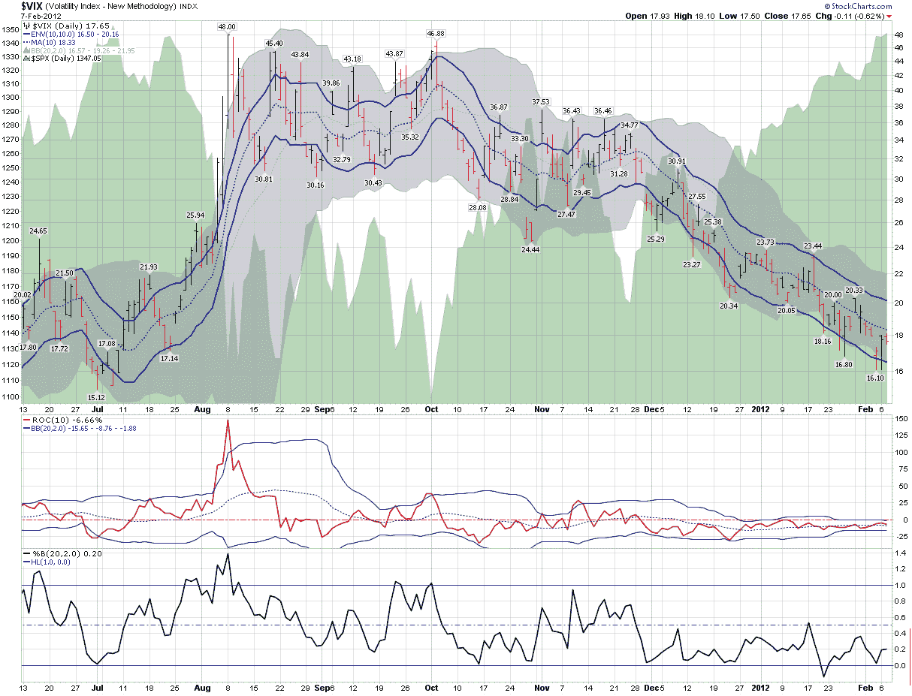

<!--yml
category: 未分类
date: 2024-05-18 16:40:54
-->

# VIX and More: What the VIX Kitchen Sink Chart Says

> 来源：[http://vixandmore.blogspot.com/2012/02/what-vix-kitchen-sink-chart-says.html#0001-01-01](http://vixandmore.blogspot.com/2012/02/what-vix-kitchen-sink-chart-says.html#0001-01-01)

One of the more interesting developments of 2012 has been to watch the diminution of the strident bearish narrative that has been focused largely on the collision course between a preponderance of debt and low or negative growth. The bullish beginning to 2012, however, has not prompted many in the way of converts to the bullish camp. Instead, there have been whispers of “…overbought…” that have turned into a soft murmur and are now verging on becoming a loud chorus. Suddenly the general consensus seems to be that stocks just do not deserve their current lofty valuation.

In this type of environment, many investors become particularly susceptible to [confirmation bias](http://vixandmore.blogspot.com/search/label/confirmation%20bias) and scramble to find one or more indicators which will tell them what they have already begun to believe: that a major correction is likely just around the corner.

For better or for worse, a look at the VIX is often one of the first stops for those who are looking for evidence of a market reversal.

In the chart below, I have updated and extended a chart from three years ago that I call my “VIX kitchen sink chart” – as it pokes and prods the VIX in a number of different ways. Standard VIX analysis attempts to determine whether the VIX has strayed too far from historical norms, whether this be in the form of moving averages, [Bollinger bands](http://vixandmore.blogspot.com/search/label/Bollinger%20bands) or other mechanisms. I have even included a separate [rate of change](http://vixandmore.blogspot.com/search/label/rate%20of%20change) study (with its own Bollinger bands) and a [Bollinger band width](http://vixandmore.blogspot.com/search/label/Bollinger%20band%20width) study below the main chart in order to provide a couple of additional analytical twists.

The bottom line, however, is this:  if stocks are overbought and a correction is indeed just around the corner, the VIX does not appear to be aware of any such inevitability. Instead, it looks a lot more like business as usual in the land of the CBOE Volatility Index.

Related posts:

**

*[source(s): StockCharts.com]*

***Disclosure(s):*** *none*