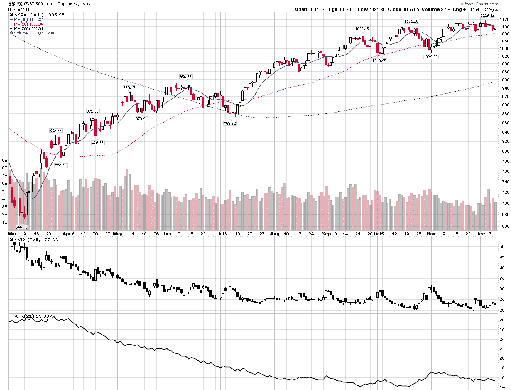

<!--yml
category: 未分类
date: 2024-05-18 17:20:33
-->

# VIX and More: When Did Volatility Bottom?

> 来源：[http://vixandmore.blogspot.com/2009/12/when-did-volatility-bottom.html#0001-01-01](http://vixandmore.blogspot.com/2009/12/when-did-volatility-bottom.html#0001-01-01)

If an investor were to have a VIX-centric view of the universe, he or she might reasonably conclude that as far as 2009 is concerned, volatility bottomed just before Thanksgiving, when the VIX made its intraday low for the year (20.05 on 11/25) or on the previous day, when the VIX had its lowest close of the year at 20.47.

In fact, if one considers only [historical volatility](http://vixandmore.blogspot.com/search/label/historical%20volatility) then the lows in historical volatility for the 10 day, 20 day and 30 day measures all fell in the second half of September. Further, an even more comprehensive volatility measure, [average true range](http://vixandmore.blogspot.com/search/label/average%20true%20range) (ATR), also shows volatility bottoming in the second half of September. As the chart below shows, ATR has not come close to touching its September and October lows during the last month. On the other hand, the VIX is in a more definitive downtrend and continued to make new lows in November.

What does all this mean? In short, it means that even as volatility has flattened out, market expectations of future volatility have continued to decline. With the [holiday effect](http://vixandmore.blogspot.com/search/label/Holiday%20Effect) expected to put a more pronounced damper on volatility starting next Monday, I would not be surprised if the VIX takes one last run at the sub-20 level before the end of the year. After the first of the year, however, I would expect historical volatility and implied volatility measure such as the VIX to start to track more closely. Whether this means historical volatility will rise to meet the VIX or the VIX will fall toward historical volatility levels remains to be seen.

For more on related subjects, readers are encouraged to check out:

 **[source: StockCharts]*

 ****Disclosure:*** *none***