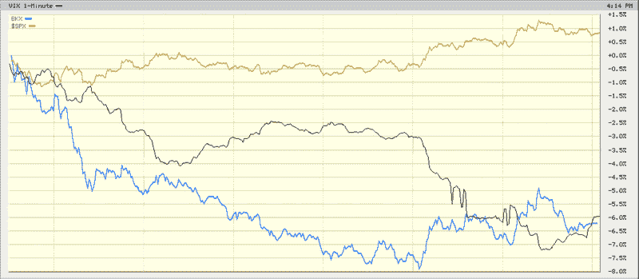

<!--yml
category: 未分类
date: 2024-05-18 18:01:52
-->

# VIX and More: When the Banks and the SPX Diverge, What Should the VIX Do?

> 来源：[http://vixandmore.blogspot.com/2009/02/when-banks-and-spx-diverge-what-should.html#0001-01-01](http://vixandmore.blogspot.com/2009/02/when-banks-and-spx-diverge-what-should.html#0001-01-01)

A simple rhetorical question: what should the VIX be tracking, the SPX or the banks?

I raise this issue because for most of today’s session, the S&P 500 index was flattish, while the VIX was down several percentage points. At the same time the financials in general and the banks in particular were struggling mightily. As the chart below shows [BKX](http://vixandmore.blogspot.com/search/label/BKX), the Keefe, Bruyette & Woods banking index, which spent the bulk of the day down 6-8%.

Does the fact that the VIX fell 5.4% while the banks sold off (-5.6%) and the SPX rose (1.6%) mean that traders of SPX options are not concerned about the future of the banks? I find this hard to believe. I would love to hear some comments on this one?

*[source: BigCharts]*