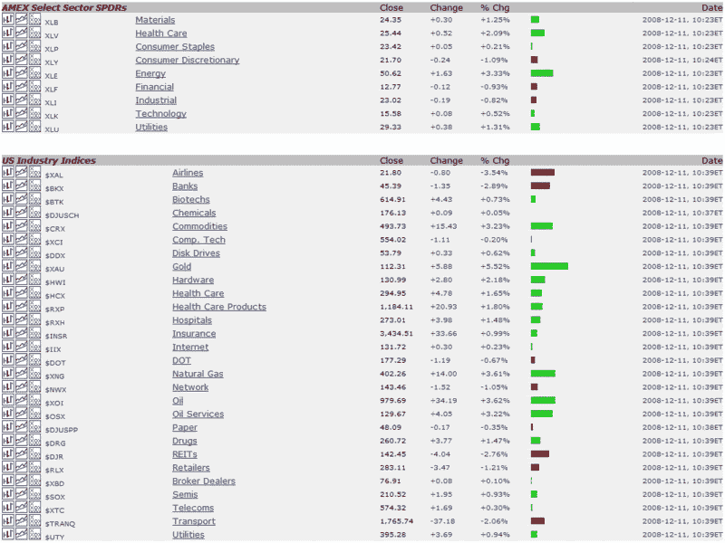

<!--yml
category: 未分类
date: 2024-05-18 18:11:29
-->

# VIX and More: Where Is the Leadership in this Rally?

> 来源：[http://vixandmore.blogspot.com/2008/12/where-is-leadership-in-this-rally.html#0001-01-01](http://vixandmore.blogspot.com/2008/12/where-is-leadership-in-this-rally.html#0001-01-01)

For the last three weeks, I have been impressed by the confidence and resolve shown by the bulls as they have consistently used pullbacks to flood the market with new long positions. Perhaps algorithms have no [fear](http://vixandmore.blogspot.com/search/label/fear)…

More recently, however, as the bull leg has stalled around the [SPX 900 mark](http://vixandmore.blogspot.com/2008/12/is-spx-going-to-stick-close-to-900.html), I have found myself thinking about the lack of ‘proper’ leadership. [Yesterday](http://vixandmore.blogspot.com/2008/12/strange-rally-with-gold-and-energy-up.html) and today, the rallies have been led by commodities, with gold and energy equities the top performers.

At the same time, the three sectors I think are most critical to the recovery, my so-called ‘[indicator species](http://vixandmore.blogspot.com/search/label/indicator%20species)’ sectors (financials, homebuilders and consumer discretionary stocks), have been unable to get out of the red today.

I am not sure where the leadership will come from that will eventually push the SPX back over 1000\. Today large cap technology names First Solar ([FSLR](http://vixandmore.blogspot.com/search/label/EBAY)), Apple ([AAPL](http://vixandmore.blogspot.com/search/label/AAPL)), Dell ([DELL](http://vixandmore.blogspot.com/search/label/DELL)), Research in Motion ([RIMM](http://vixandmore.blogspot.com/search/label/RIMM)), eBay ([EBAY](http://vixandmore.blogspot.com/search/label/EBAY)) and Intel ([INTC](http://vixandmore.blogspot.com/search/label/INTC)) are all strong performers. Frankly, I would expect technology to play a strong role in the next big leg up, but leadership may come from a number of other sectors.

There are few guarantees in the stock market, but I can guarantee that gold and energy are not going to pull the SPX up over the 1000 mark and leave financials ([XLF](http://vixandmore.blogspot.com/search/label/XLF)), homebuilders ([XHB](http://vixandmore.blogspot.com/search/label/XHB)), and consumer discretionary stocks ([XLY](http://vixandmore.blogspot.com/search/label/XLY)) behind.

*[source: StockCharts]*