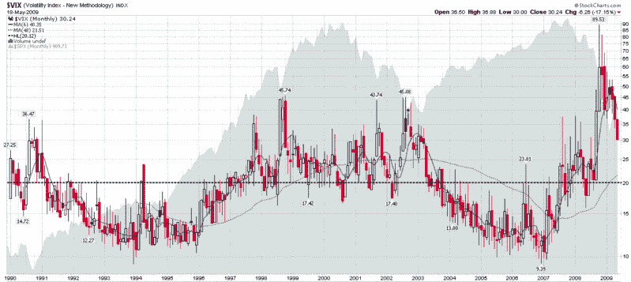

<!--yml
category: 未分类
date: 2024-05-18 17:47:00
-->

# VIX and More: Where Will the VIX Bottom?

> 来源：[http://vixandmore.blogspot.com/2009/05/where-will-vix-bottom.html#0001-01-01](http://vixandmore.blogspot.com/2009/05/where-will-vix-bottom.html#0001-01-01)

As I write this, the VIX is at 28.80, after making an intraday low of 28.51 earlier in the session. Since this is the first time the VIX has traded below 30.00 since the middle of September, I am finding there is a great deal of interest in and speculation surrounding where the VIX will ultimately bottom – and what the implications are for equities.

In both [How Low Can the VIX Go?](http://vixandmore.blogspot.com/2009/05/how-low-can-vix-go.html) and [The New VIX Macro Cycle Picture](http://vixandmore.blogspot.com/2009/04/new-vix-macro-cycle-picture.html), I predicted that the VIX is not likely to drop below the 25-26 level – and I am standing by that prediction. Actually, in my [newsletter](http://vixandmoresubscriber.blogspot.com/) I have been a little more precise, saying during the past few weeks that I do not anticipate the VIX falling below 28.00 “for this leg of the bull market.” Frankly, this leg looks a little long in the tooth to me at the moment, but based on the recent price action, the current phase has more of the appearance of consolidation than reversal or impending reversal.

I have weighed in on several occasions about the perils of using the full technical analysis toolbox on the VIX, largely because there is no underlying one can buy and sell, given that the VIX is really just a calculated value. For these reasons – and given the VIX’s tendency toward [mean reversion](http://vixandmore.blogspot.com/search/label/mean%20reversion) – I tend to shy away from momentum indicators and oscillators when evaluating the VIX and treat moving averages and support and resistance with several grains of salt.

Let me take a minute and put a VIX of 25 into some historical context. First, the historical average of the VIX for 20 years of data extending back to 1990 is 20.12 (dotted black line in the chart below.) The mean VIX for all of 2008, which includes a relatively calm April through August, is 32.68\. Looking back at the five year period of [1998](http://vixandmore.blogspot.com/search/label/1998)-[2002](http://vixandmore.blogspot.com/search/label/2002), which included the [Long-Term Capital Management](http://en.wikipedia.org/wiki/Long-Term_Capital_Management) debacle and the end of the 1990s bull market, the average VIX during this period was 25.27\. Current data show S&P 500 historical volatility for the 10, 20 and 30 day lookback periods at 30.88, 27.24 and 30.53, respectively.

The bottom line: 25.00 is a low number for a volatile period.

The VIX may be better analyzed in a macroeconomic and geopolitical context than in terms of technical analysis. Ultimately, the VIX is only rarely a fear index. Most of the time, the volatility index is more accurately a measure of uncertainty or investor anxiety. With the bank stress test results behind us, concerns about [structural volatility](http://vixandmore.blogspot.com/search/label/structural%20volatility) and systemic risk are now receding and being supplanted by lower anxiety concerns that I like to refer to as [event volatility](http://vixandmore.blogspot.com/search/label/event%20volatility). Sure, the economy may have another significant misstep ahead, but talk of wholesale bank nationalization and the prospect of 15% unemployment have been replaced by discussions of green shoots, bottoming and recovery.

[As an aside, for awhile now I have been thinking about constructing something akin to a [Beaufort scale](http://en.wikipedia.org/wiki/Beaufort_scale) for volatility so we can put absolute measures of volatility into a broader context.]

Regarding the current volatility environment, while confidence and liquidity are returning to the markets, keep in mind that for many investors, the financial and psychological scars are still in the healing process. As long as events and markets continue to improve, that healing process will continue. Should events take a sudden turn for the worse, however, I would expect to see volatility spike dramatically in a case of [echo volatility](http://vixandmore.blogspot.com/search/label/echo%20volatility), much like what I described in [What My Dog Can Tell Us About Volatility](http://vixandmore.blogspot.com/2007/01/what-my-dog-can-tell-us-about_947.html).

In the absence of another spike in volatility, I would also expect to see a dramatic decline in the rate that volatility is decreasing, as we begin to approach a floor in volatility. Even as fears dissipate, there is still uncertainty about the strength of the recovery in addition to the normal uncertainty about the direction of the economy and the markets that would be associated with a period of relative market calm.

Historical volatility, therefore, should provide a volatility floor and with historical volatility currently unable to drop below the low to mid-20s, we should begin to see evidence of that volatility floor shortly. I have seen some investors call for the flood of liquidity to push the VIX under 20\. I just don’t see it, at least for now. There is the possibility that stocks enter into an extended period of range-bound trading that brings volatility down to the low 20s, but I would be surprised to see a sub-20 VIX by the end of the year.

In 2007, the VIX ended the year at 22.50\. While my crystal ball generally does not extend more than a month or two, my best guess is that we see the VIX in the 22.50 to 25.00 range at the end of 2009.

*[source: StockCharts]*