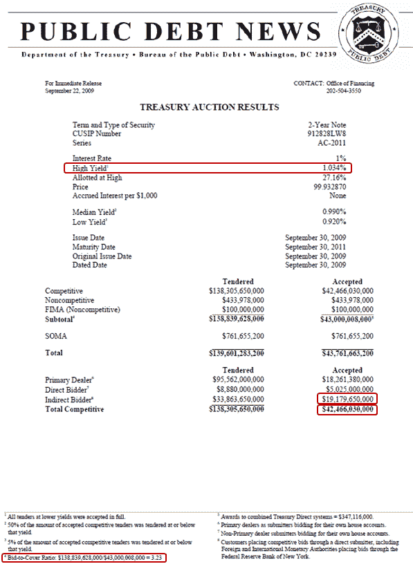

<!--yml
category: 未分类
date: 2024-05-18 17:28:49
-->

# VIX and More: Where and How to Analyze Treasury Auction Results

> 来源：[http://vixandmore.blogspot.com/2009/09/where-and-how-to-analyze-treasury.html#0001-01-01](http://vixandmore.blogspot.com/2009/09/where-and-how-to-analyze-treasury.html#0001-01-01)

Following [An Introduction to Treasury Auctions](http://vixandmore.blogspot.com/2009/08/introduction-to-treasury-auctions.html) and [The Recent Treasury Auction Brouhaha](http://vixandmore.blogspot.com/2009/08/recent-treasury-auction-brouhaha.html), I have received several requests from readers on where to obtain the relevant auction data and how to calculate the yield, bid-to-cover ratio and percentage of indirect bidders. It would be nice if there were an archived table of all this information, but [the table of results](http://www.treasurydirect.gov/RI/OFNtebnd) for recent Treasury Note auctions omits both the bid-to-cover ratio and percentage of indirect bidders.

As best as I can determine, anyone seeking to capture the history of auctions for a particular bond needs to do so manually. I will quickly walk through how this can be done. First, start by selecting a particular security in the *Search by Security Type* list at the page with the title [Treasury Marketable Security Offering Announcement Press Releases](http://www.treasurydirect.gov/instit/annceresult/press/press_secannpr.htm). Selecting the [2-Year Notes](http://www.treasurydirect.gov/instit/annceresult/press/preanre/preanre_2yr.htm) will bring up a page with all the data grouped by calendar year. Clicking on 2009 brings you to [2009 Treasury Security Auction Press Releases: 2-Year Notes](http://www.treasurydirect.gov/instit/annceresult/press/preanre/2009/2009_2year.htm). On this page, each auction date has three rows associated with it: Announcement; Prelim. Noncomp. Results; and Auction Results.

By selecting the PDF version of the [9/22 auction results](http://www.treasurydirect.gov/instit/annceresult/press/preanre/2009/R_20090922_3.pdf), I can pull up today’s auction data. The yield to focus on is the *High Yield*, which was 1.034% for today’s auction. At the very bottom left, the press release notes the bid-to-cover ratio of 3.23 and provides the source data for the numerator and denominator. Finally, the percentage of indirect bidders is not calculated in the press release, but can be easily computed by dividing the Indirect Bidder – Accepted number by the Total Competitive – Accepted number. Today, that translated into an indirect bidder percentage of 45.2%.

Of course the best way to analyze the numbers is to watch and see how the market reacts to the prices and yields not just for the bond in question, but across the entire yield curve. In evaluating bid-to-cover ratios and the percentage of indirect bidders, analysts tend to compare the current auction to the most recent auction of the same security and to an average of the past 10-12 auctions of that security.

For two superb blogs with a bond focus, I continue to recommend:

*[source: TreasuryDirect]*