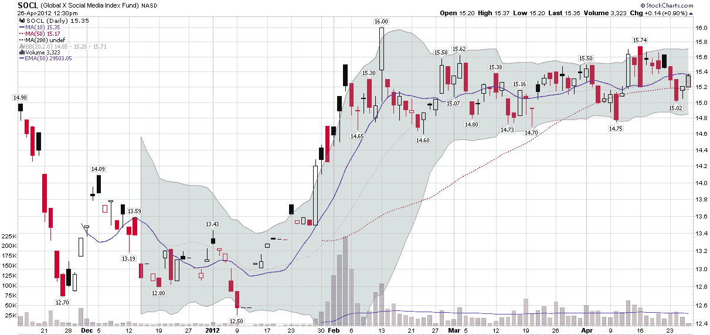

<!--yml
category: 未分类
date: 2024-05-18 16:31:51
-->

# VIX and More: Whither Social Media Stocks?

> 来源：[http://vixandmore.blogspot.com/2012/04/whither-social-media-stocks.html#0001-01-01](http://vixandmore.blogspot.com/2012/04/whither-social-media-stocks.html#0001-01-01)

Back in October 2007, sensing a little too much froth in the stock market, I created something I called the [OHFdex](http://vixandmore.blogspot.com/search/label/OHFdex), which began as a “watch list of Overripe High Fliers” and quickly evolved into an index designed to track 14 such stocks. When the markets turned down, the group was pummeled, with some [spectacular crashes](http://vixandmore.blogspot.com/2008/10/ohfdex-one-year-later.html) from the likes of CROCS ([CROX](http://vixandmore.blogspot.com/search/label/CROX)), Las Vegas Sands ([LVS](http://vixandmore.blogspot.com/search/label/LVS)), DryShips ([DRYS](http://vixandmore.blogspot.com/search/label/DRY)) and others.

As stocks have continued their rise, I have thought about resurrecting the OHFdex, but I have not found sufficient reason to do so, until recently. The rise of social media stocks and some of the attendant valuations are the reason for my reconsidering the OHFdex. Clearly there will be winners as well as losers in this space, but relatively high valuations for LinkedIn ([LNKD](http://vixandmore.blogspot.com/search/label/LNKD)), Groupon ([GRPN](http://vixandmore.blogspot.com/search/label/GRPN)), Zynga ([ZNGA](http://vixandmore.blogspot.com/search/label/ZNGA)), Pandora ([P](http://vixandmore.blogspot.com/search/label/P)), Yelp ([YELP](http://vixandmore.blogspot.com/search/label/YELP)), Angie’s List ([ANGI](http://vixandmore.blogspot.com/search/label/ANGI)), Jive Software ([JIVE](http://vixandmore.blogspot.com/search/label/JIVE)) and others have raised my eyebrows and even the launch of a Social Media ETF ([SOCL](http://vixandmore.blogspot.com/search/label/SOCL), [holdings](http://globalxfunds.com/fundholdings.php?fundid=20164&catid=27)) is enough to give me pause. The problem is that I have trouble picking the big winner from this group, particularly when adjusted for current market capitalization. The temptation is to short them all, but for now at least, it is time to put these stocks and counterparts such as [RENN](http://vixandmore.blogspot.com/search/label/RENN), [YOKU](http://vixandmore.blogspot.com/search/label/YOKU), [SOHU](http://vixandmore.blogspot.com/search/label/SOHU), [REDF](http://vixandmore.blogspot.com/search/label/REDF), [DMD](http://vixandmore.blogspot.com/search/label/DMD), [FFN](http://vixandmore.blogspot.com/search/label/FFN), etc. into a social media OHFdex and see how things play out.

I’m not saying this is October 2007 or tech media bubble 2.0, but every coal mine needs at least one canary.

As an aside, while I am lukewarm about the prospects for social media as a whole, I have been living on the bleeding edge of technology hardware and software for decades and am about as far from being a Luddite as one can be. I was surfing the Internet in the 80s, dragged my laptop on planes for at least two years before I saw anyone else do the same, had a US Robotics before it was branded “Palm Pilot,” bought my first digital camera in 1996, was on Facebook when it existed only inside two universities, and sometimes think that too much of my life has been spent as an inadvertent beta tester.

That being said, while it can be lots of fun to play with v0.9 of what might be the next big wave in technology, I wouldn’t recommend buying too many v0.9 stocks, particularly those that are based on nascent technologies.

Finally, if you have any interest in shorting these stocks and can’t find any shares available to short, consider buying puts, selling calls or creating a [synthetic](http://vixandmore.blogspot.com/search/label/synthetic) short position by doing both at the same time.

Related posts:

**

*[source(s): StockCharts.com]*

***Disclosure(s):*** *short GRPN, ZNGA, P and YELP at time of writing*