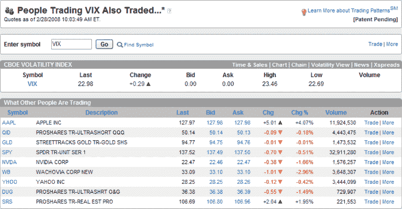
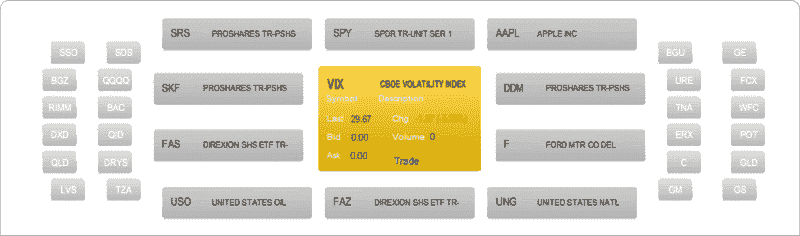
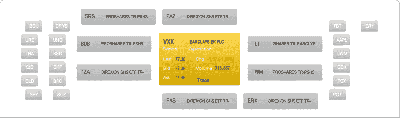

<!--yml
category: 未分类
date: 2024-05-18 17:42:13
-->

# VIX and More: Who Trades the VIX and VXX?

> 来源：[http://vixandmore.blogspot.com/2009/06/who-trades-vix-and-vxx.html#0001-01-01](http://vixandmore.blogspot.com/2009/06/who-trades-vix-and-vxx.html#0001-01-01)

Several times in the past, I have had some fun the [Trading Patterns](http://vixandmore.blogspot.com/search/label/Trading%20Patterns) feature at optionsXpress, including a February 2008 post, [optionsXpress Trading Patterns and the VIX](http://vixandmore.blogspot.com/2008/02/optionsxpress-trading-patterns-and-vix.html), which examined the securities that optionsXpress customers who traded the VIX were also trading.

Given all that has happened in the past 16 months, I thought it might be interesting to see what the current crop of VIX traders are trading – and also to contrast this with traders of [VXX](http://vixandmore.blogspot.com/search/label/VXX), the VIX ETN.

First, the VIX trader snapshot from February 28, 2008 shows leveraged short positions in real estate, technology and oil.

I have expanded today’s snapshot of the VIX trader to include a larger list of securities. Clearly, some themes remain, such as the bias for leveraged short positions in real estate and finance, as well as interest in some of the most volatile momentum stock plays.

Finally, looking at the VXX trader, both ETFs in general and the leveraged ETF plays in particular are even more important parts of the trading approach.

In terms of conclusions, I am cognizant that the optionsXpress customer base is a retail-oriented subset of the broader trading crowd and not necessarily representative of the bulk of the volume of VIX and VXX trades. From the graphics above, however, it is difficult to make the case that traders are using the VIX and VXX for [hedging](http://vixandmore.blogspot.com/search/label/hedging). Based on available data, traders who trade the VIX and VXX are typically trading the most volatile leveraged securities available. At the very least, the connection between the VIX and leveraged ETFs appears to be very strong among those traders who prefer to focus on the most volatile nuclear-tipped trading vehicles.

*[source: optionsXpress]*

***Disclosure****: Long VXX and neutral position in VIX via options at time of writing*