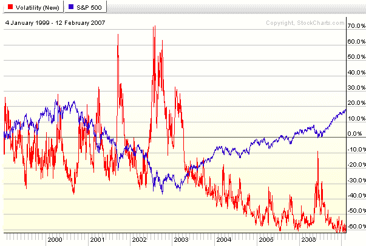

<!--yml
category: 未分类
date: 2024-05-18 15:59:28
-->

# VIX and More: Why an Entire Blog Dedicated to the VIX?

> 来源：[http://vixandmore.blogspot.com/2007/02/why-entire-blog-dedicated-to-vix_13.html#0001-01-01](http://vixandmore.blogspot.com/2007/02/why-entire-blog-dedicated-to-vix_13.html#0001-01-01)

Someone has to be wondering about this, even if I haven’t been asked yet.

Here is the reasonably concise answer:

In December 2006, I began wondering when we were going to have a correction from the July rally (I’m still wondering) and set about to look at a bunch of sentiment and other [contrary indicators](http://bigpicture.typepad.com/comments/2003/09/contrary_indica.html) that might support my case.  One that particularly caught my attention was the VIX, not just because of the obvious negative correlation to the SPX (see graph below), but also because options are actively traded in the VIX and could provide a more leveraged play than say the [QID](http://finance.yahoo.com/q?s=QID) in a nasty downturn.  I did some Googling and concluded that if there are any VIX ‘experts’ out there, they are certainly not a publicity-seeking bunch.

So I download the [VIX price history data](http://finance.yahoo.com/q/hp?s=%5EVIX) to Excel and started playing around with it.  I posted some observations on an [InvestorVillage forum](http://www1.investorvillage.com/smbd.asp?mb=6863&pt=m&clear=1) and decided that a blog would be a much more convenient way to archive my thoughts.

That’s about it.

I find it ironic that I now have a VIX blog and am now thinking regularly about implied volatility issues, as I am not an “options guy” per se, having traded almost exclusively equities for the past 20 years, with the exception of an occasional outright purchase of a call or a put, and a rare covered call play.  Only in the past month have I made my first foray into (bear call) spreads.

So that is why I call this a “learning laboratory of sorts.”

Initially, I thought I might tackle a wide variety of sentiment-related issues, but since [Zen’s Market Insights](http://zentrader13.blogspot.com/), [HeadlineCharts](http://headlinecharts.blog.com/), and others do such a good job of covering the waterfront there, is not a high priority for me at this stage.

I will, however, experiment with the “and More” portion of this blog soon enough.  Hell, [espn](http://espn.go.com/) has never figured out what to do with the “e” at the beginning of their name, so I am not worried about how long it takes me to sort it out.

Thanks to all who have contributed here in one way or another.

As always, comments and suggestions are welcome.