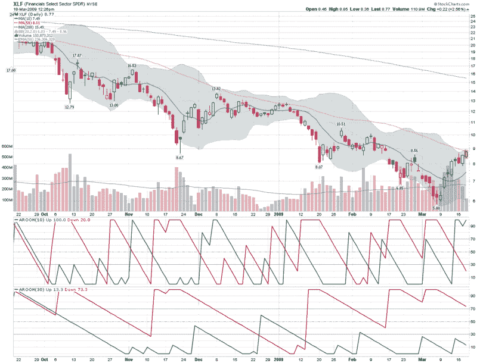

<!--yml
category: 未分类
date: 2024-05-18 17:55:01
-->

# VIX and More: XLF Bias Depends on Time Frame

> 来源：[http://vixandmore.blogspot.com/2009/03/xlf-bias-depends-on-time-frame.html#0001-01-01](http://vixandmore.blogspot.com/2009/03/xlf-bias-depends-on-time-frame.html#0001-01-01)

Lately it seems as if the financial sector *is* the market. For this reason, I now watch the financial sector SPDR ([XLF](http://vixandmore.blogspot.com/search/label/XLF)) and the KBW Bank Index ([BKX](http://vixandmore.blogspot.com/search/label/BKX)) tick by tick, in addition to a handful of financial stocks that seem to be in the most peril on a particular day.

In my opinion, however, XLF is the best way to capture the full extent of goings on in the financial sector, from banks and brokerage houses to insurers and consumer finance companies, XLF pretty much covers the waterfront.

The chart below captures the last six months of action in XLF and highlights the problem facing XLF and the broader markets at the moment. Stocks are overbought in the short-term and oversold in the long-term.

Rather than use oscillators to show how overbought and oversold stocks are, I generally prefer to rely on a combination of moving averages and trend strength indicators, with volatility as an important secondary indicator. Looking at the moving averages, XLF is now well above the 10 day MA and running up against resistance in the form of the 50 day MA. In terms of trend, utilizing the [Aroon](http://vixandmore.blogspot.com/search/label/Aroon) indicator to measure trend and breakout strength, XLF is bullish in the 10 day calculations, but bearish from a 30 day perspective. In this chart there is not much to see in terms of volatility, but by tracking in the upper half of the [Bollinger Bands](http://vixandmore.blogspot.com/search/label/Bollinger%20bands), XLF generally has positive short-term momentum, while proximity to the upper band suggests a reversal is likely soon.

So there you have it: bullish momentum triggering buying on the part of the trend following crowd, while overbought indicators have the swing trading crowd ready to get short. Such is the current state of the market. The direction in which you lean is more likely to be a function of the [time horizon](http://vixandmore.blogspot.com/search/label/time%20horizon) of your analysis than any other technical factor.

*[source: StockCharts]*

 ****Disclosure****: Short XLF at time of writing.**