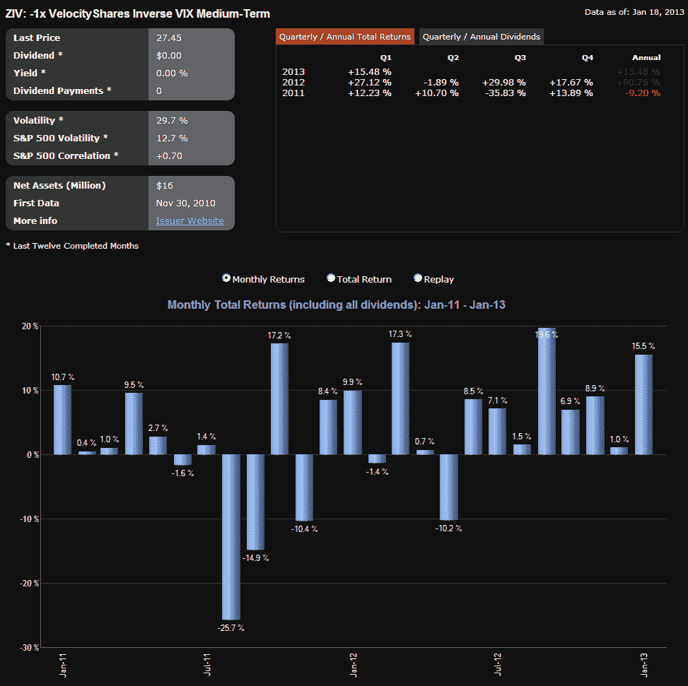

<!--yml
category: 未分类
date: 2024-05-18 16:19:03
-->

# VIX and More: ZIV Starting to Gain Momentum

> 来源：[http://vixandmore.blogspot.com/2013/01/ziv-starting-to-gain-momentum.html#0001-01-01](http://vixandmore.blogspot.com/2013/01/ziv-starting-to-gain-momentum.html#0001-01-01)

One year ago, I wrote [ZIV Undeservedly Neglected](http://vixandmore.blogspot.com/2013/01/vix-etp-performance-in-2012.htmlhttp:/vixandmore.blogspot.com/2012/11/performance-of-vix-etps-during-current.htmlhttp:/vixandmore.blogspot.com/2012/09/updates-to-vix-etp-landscape-add-vixh.html) when [ZIV](http://vixandmore.blogspot.com/search/label/ZIV) was trading about 5,000 shares per day and was not even on the radar of many investors who follow the [VIX exchange-traded products](http://vixandmore.blogspot.com/search/label/VIX%20ETN) space. In the land of inverse VIX-based ETPs, it seemed as if [XIV](http://vixandmore.blogspot.com/search/label/XIV) was destined to grab all the headlines and the glory, with ZIV relegated to distant also-ran status. Frankly, I was somewhat concerned that ZIV was an ETP with a great deal of potential that might be shuttered due to neglect long before mainstream investors had an opportunity to discover its charms.

One year later, ZIV is still struggling to find adherents, trading approximately 60,000 shares per day as of late, while its performance has become even more difficult to ignore. Over the past year, ZIV is up 103%; and during that period it had a maximum drawdown of only 19%, as the graphic below illustrates. Of course, one can never cut and paste past performance into the future with any degree of certainty, but the record over the course of the past year points toward the potential of ZIV, neglected or otherwise.

*[source(s): ETFreplay.com]*

A year ago, I summarized some of my thinking on ZIV as follows:

> *“I am frankly surprised by the lack of interest investors have shown in ZIV, the VelocityShares Daily Inverse VIX Medium-Term ETN. In a nutshell, ZIV has many of the same benefits of long XIV and/or short [VXX](http://vixandmore.blogspot.com/search/label/VXX) positions, with much less risk. Specifically, ZIV benefits from negative roll yield about 65% of the time, with VIX futures data going back to 2004 indicating that the annual benefit due to negative roll averages out at more than 20% per year. With XIV getting all the attention, I wonder if investors are aware that XIV is down and ZIV is up since the two products were launched.*
> 
> *Of course, like XIV, ZIV is exposed to sharp spikes in the VIX, as the chart below reflects. It is worth noting, however, that when the VIX spikes, ZIV can be expected to lose value at about half the rate of losses in XIV. For example, while XIV was falling 75%, ZIV was down 42%.  It bears repeating that one of the key features of inverse volatility products is that the potential for large short-term losses is significant, even though the long-term prospects are promising.”*

Going forward, ZIV is going to have to make it or break it on its own merits, but for those few who have enjoyed the ride for the past year, it is clear that the potential is enormous – at least under certain market environments.

Related posts:

***Disclosure(s):*** *long XIV and ZIV, short VXX at time of writing*