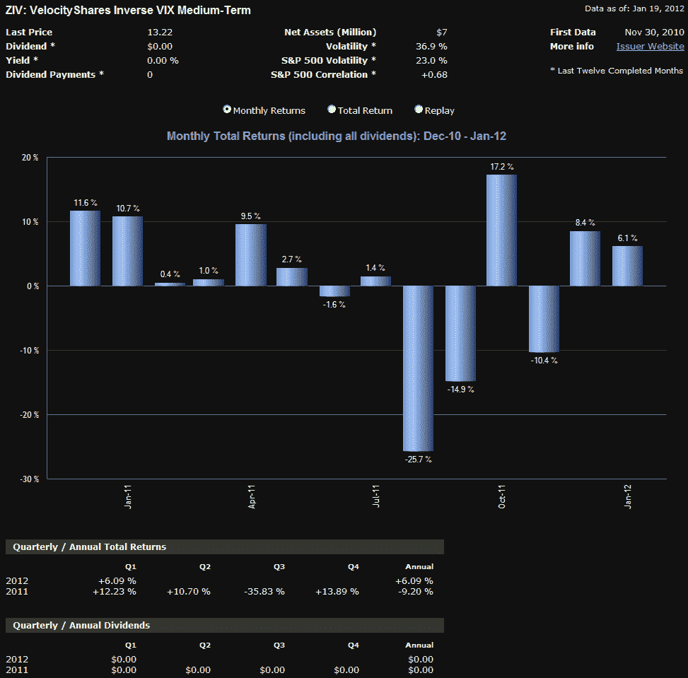

<!--yml
category: 未分类
date: 2024-05-18 16:42:47
-->

# VIX and More: ZIV Undeservedly Neglected

> 来源：[http://vixandmore.blogspot.com/2012/01/ziv-undeservedly-neglected.html#0001-01-01](http://vixandmore.blogspot.com/2012/01/ziv-undeservedly-neglected.html#0001-01-01)

Much to my amazement, next week will mark the third anniversary of the launch of the first two [VIX ETPs](http://vixandmore.blogspot.com/search/label/VIX%20ETN): the S&P 500 VIX Short-Term Futures ETN ([VXX](http://vixandmore.blogspot.com/search/label/VXX)) and the S&P 500 VIX Mid-Term Futures ETN ([VXZ](http://vixandmore.blogspot.com/search/label/VXZ)).

Some may recall that investors were slow to warm up to these ETNs (see [Charting the Assets of Volatility-Based ETPs](http://vixandmore.blogspot.com/2011/01/charting-assets-of-volatility-based.html)), but these two products are now #1 and #5 in the very successful volatility ETP space, with assets of $700 million and $188 million, respectively.

It is no secret that VXX has always been the darling of short-term traders, while VXZ has struggled at times to find a broad audience. As investors have become better educated about the influence of the [VIX futures](http://vixandmore.blogspot.com/search/label/VIX%20futures) [term structure](http://vixandmore.blogspot.com/search/label/term%20structure) and resulting [roll yield](http://vixandmore.blogspot.com/search/label/roll%20yield) on returns, interest in VXZ relative to VXX has picked up, but the latter, with its target maturity of five months, continues to play second fiddle to its short-term (one month target maturity) sibling.

I was curious see how this dynamic played out when VelocityShares rolled out two products that are essentially the inverse of VXX and VXZ in November 2010\. Once again the short-term product captured the bulk of the interest of traders, as [XIV](http://vixandmore.blogspot.com/search/label/XIV) quickly established itself as the #2 product in the VIX ETP space. While the love for XIV is certainly understandable, due to the history of persistent [contango](http://vixandmore.blogspot.com/search/label/contango) and negative [roll yield](http://vixandmore.blogspot.com/search/label/roll%20yield) in VIX futures, this product suffered a huge drawdown as the [European sovereign debt crisis](http://vixandmore.blogspot.com/search/label/European%20sovereign%20debt%20crisis) and resulting record [backwardation](http://vixandmore.blogspot.com/search/label/backwardation) wiped out 75% of the ETPs value from July through November 2011.

Against this backdrop, I am frankly surprised by the lack of interest investors have shown in [ZIV](http://vixandmore.blogspot.com/search/label/ZIV), the VelocityShares Daily Inverse VIX Medium-Term ETN. In a nutshell, ZIV has many of the same benefits of long XIV and/or short VXX positions, with much less risk. Specifically, ZIV benefits from negative roll yield about 65% of the time, with VIX futures data going back to 2004 indicating that the annual benefit due to negative roll averages out at more than 20% per year. With XIV getting all the attention, I wonder if investors are aware that XIV is down and ZIV is up since the two products were launched.

Of course, like XIV, ZIV is exposed to sharp spikes in the VIX, as the chart below reflects. It is worth noting, however, that when the VIX spikes, ZIV can be expected to lose value at about half the rate of losses in XIV. For example, while XIV was falling 75%, ZIV was down 42%.  It bears repeating that one of the key features of inverse volatility products is that the potential for large short-term losses is significant, even though the long-term prospects are promising.

Finally, for those who are investing in or trading VIX-based ETPs, it is important to keep in mind that short-term returns are most likely to be a function of changes in the VIX and VIX futures, while long-run returns will be dominated by the VIX futures term structure.

Related posts:

**

*[source(s): ETFreplay.com]*

 ****Disclosure(s):*** *long XIV and ZIV, short VXX at time of writing**