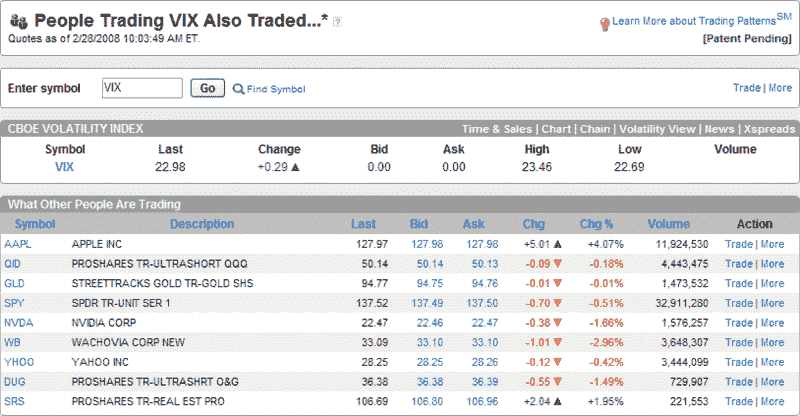

<!--yml
category: 未分类
date: 2024-05-18 18:42:19
-->

# VIX and More: optionsXpress Trading Patterns and the VIX

> 来源：[http://vixandmore.blogspot.com/2008/02/optionsxpress-trading-patterns-and-vix.html#0001-01-01](http://vixandmore.blogspot.com/2008/02/optionsxpress-trading-patterns-and-vix.html#0001-01-01)

One of the trading tools that satisfies my inner investment voyeur is the [Trading Patterns](http://vixandmore.blogspot.com/search/label/Trading%20Patterns) feature at optionsXpress.  If the “Trading Patterns” name doesn’t ring a bell, you might also know this feature as “People Trading ___ Also Traded…” in the spirit of Amazon’s recommendation technology and predecessor technology that dates back to internet pioneer [Firefly Network Inc.](http://www.businessweek.com/1996/41/b349690.htm)

In the past, I have used the Trading Patterns data to see which companies were being most actively traded by those who are seeking high risk speculative momentum plays.  I somewhat arbitrarily made [BIDU](http://vixandmore.blogspot.com/search/label/BIDU) the poster child for these momentum chasers and have twice looked at what those who were playing with BIDU [were also trading](http://vixandmore.blogspot.com/2007/10/update-on-people-trading-bidu-also.html).

With all the discussion around potential [substitutes for the VIX](http://vixandmore.blogspot.com/2008/02/rising-popularity-of-xlf-options.html) at least as a hedging tool, I thought it might be interesting to get a broader picture of those who trade VIX options.  Thanks to Trading Patterns, I have captured just such a snapshot below.  Not surprisingly, VIX traders are aggressive risk takers.  In aggregate, they appear to be hoarding gold ([GLD](http://finance.google.com/finance?q=gld)) and going short with the double inverse ETFs for real estate ([SRS](http://finance.google.com/finance?q=srs)) and the NASDAQ-100 index ([QID](http://finance.google.com/finance?q=qid)).  It’s just a guess about the direction of some holdings, but the other positions appear to fall squarely in the short finance and technology camp: [SPY](http://finance.google.com/finance?q=spy), [WB](http://finance.google.com/finance?q=wb), [AAPL](http://finance.google.com/finance?q=aapl), [YHOO](http://finance.google.com/finance?q=yhoo), and [NVDA](http://finance.google.com/finance?q=nvda).  The one finding that I see as somewhat surprising is the presence of the ProShares Ultrashort Oil & Gas ETF ([DUG](http://finance.google.com/finance?q=dug)).  Given the list of trading vehicles, I am concluding that the VIX players see oil and gas as overbought instead of a safe haven like gold.  In any event, it is clear that the pessimism of VIX traders continues to be grounded in an expansion of the real estate and financial woes, the expectation that this will drag technology down with it, and the opinion that gold is the most sensible long position at the moment.

