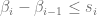
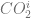

<!--yml
category: 未分类
date: 2024-05-13 00:16:08
-->

# VPP Pricing II: Mixed Integer Linear Programming – HPC-QuantLib

> 来源：[https://hpcquantlib.wordpress.com/2011/06/23/vpp-pricing-ii-mixed-integer-linear-programming/#0001-01-01](https://hpcquantlib.wordpress.com/2011/06/23/vpp-pricing-ii-mixed-integer-linear-programming/#0001-01-01)

The next two steps are defining a simple VPP contract (or a simplified gas-run power plant) and setting up a mixed integer linear programming optimization (MIP) to calculated the intrinsic value and an upper bound for the extrinsic value based on a Monte-Carlo simulation and assuming *perfect foresight*. The third step outlined in the next part will then be the “exact” pricing of the extrinsic value using dynamic programming and finite difference methods.

The set-up of the simplified gas-run power plant is similar to the one explained in chapter 4.2.3 of the text-book [1]. In general the power plant has three power output level:

*   Plant is off, 
*   Generation at minimum load 
*   Generation at maximum load 

The power plant has a fixed efficiency rate

.

Ramp rates will be neglected, but the power plant has a minimum uptime  and a minimum downtime . The start-up costs are given by a fixed start-up cost  (in €) and the price of the gas needed to produce the start-up heat  (in MWh).

The mixed integer linear optimization is running in one hour blocks and is using three decision variables per hour . The binary decision variable  is true if the power plant is running at minimum load  or at maximum load  and  is false if the plant is off. The real decision variable  is equal to one if the plant is started in hour , which is implied by the following constraint

.

The minimum up-time  and the minimum down-time  is a consequence of the constraints

![\begin{array}{rcl} \beta_i &\ge& \sum_{t=i-t_{up}+1}^{t=i} s_t \\[7pt] \beta_i &\le& 1-\sum_{t=i+1}^{t=i+t_{down}} s_t \end{array}](img/6c9ce869fd21ff4f135816f050204369.png)

The real decision variable  is equal to one if the power plant is running at maximum load  and zero if the power plant is either running at minimum load  or if the plant is off, that means

Let  be the power price,  be the gas price and  be the carbon dioxide price at hour . The objective function is then given by

![P\& L = \sum_{t=1}^N\left[\left(\gamma_iP_{max} + P_{min}(\beta_i-\gamma_i)\right) \left(P_i - \frac{G_i+CO_2^i}{\zeta}\right) - s_i\left(\eta + \theta (G_i+CO_2^i)\right)\right]](img/a23fead6eabe08004bb479b6923100fd.png)

For a one year span the problem consists of  decision variables  and  constraints. This comparable small problem can be solved using e.g. the [Gnu Linear Programming Kit](http://www.gnu.org/software/glpk/) (GLPK). For an overview on open source linear/mixed integer programming solver see [2].

The model parameters and the example forward curves are outlined in the previous entry [VPP Pricing I](https://hpcquantlib.wordpress.com/2011/06/13/vpp-pricing-i-stochastic-processes-partial-integro-differential-equation/). The diagram below shows the intrinsic value and the upper bound for the total value (intrinsic plus extrinsic value) based on Monte-Carlo, perfect foresight and MIP for different  power plant efficiencies . The parameters of the VPP contract are given by

,

the (fixed) carbon dioxide price is 3.0€ per MWh heat.  

The source code is available [here](http://hpc-quantlib.de/src/vpp2.zip). It depends on [GLPK](http://www.gnu.org/software/glpk) and the latest [QuantLib](http://www.quantlib.org/) version from the [SVN trunk](http://sourceforge.net/p/quantlib/code/HEAD/tree/) or the next QuantLib 1.2 release.

It is now quite easy to add and price time-integral constraints, e.g. the following constraint restricts the number of starts within a year to be less than or equal to a given number

.

The following diagram shows the results for  and a minimum load .

The source code is available [here](http://hpc-quantlib.de/src/vpp3.zip). It depends on QuantLib 1.1 and if  you want to generate the plot directly from the C++ program you’ll also need [R](http://www.r-project.org/), [RCPP](http://cran.r-project.org/web/packages/Rcpp/index.html) and [RInside](http://cran.r-project.org/web/packages/RInside/index.html).

[1] M. Burger, B. Graeber, G. Schindlmayr, Managing Energy Risk, ISDN 978-0-470-ß2962-6

[2] S. R. Thorncraft, [Evaluation of Open-Source LP Optimization Codes in Solving Electricity Spot Market Optimization Problems.](http://www.ceem.unsw.edu.au/content/userDocs/stu-ORMMES06_Benchmarking_20060610_FINAL_CEEM.pdf)