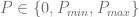
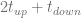
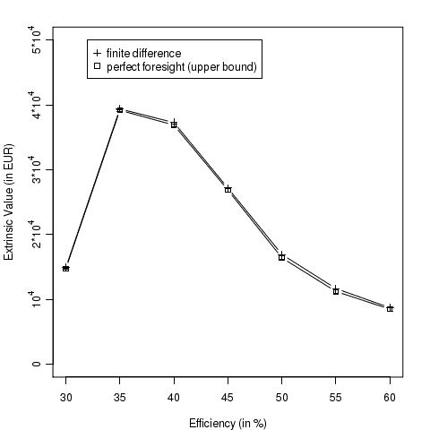
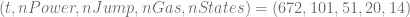

<!--yml
category: 未分类
date: 2024-05-17 23:39:37
-->

# VPP Pricing III: Exact Pricing based on Finite Difference Methods – HPC-QuantLib

> 来源：[https://hpcquantlib.wordpress.com/2011/08/07/vpp-pricing-iii-exact-pricing-based-on-finite-difference-methods/#0001-01-01](https://hpcquantlib.wordpress.com/2011/08/07/vpp-pricing-iii-exact-pricing-based-on-finite-difference-methods/#0001-01-01)

The total value of a virtual power pant (VPP) can be decomposed in an intrinsic part plus an extrinsic part. The intrinsic value is given by the cash-flows that the VPP would generate based on the current power and gas forward curve. Therefore the intrinsic value can be calculated without defining a stochastic model for the power and gas prices using either linear or dynamic optimization methods. Calculating the extrinsic value implies pricing the VPP exactly to calculate the total value for a given stochastic process. The model in use here is outlined in the article [VPP Pricing I: Stochastic Processes & Partial Integro Differential Equation.](../2011/06/13/vpp-pricing-i-stochastic-processes-partial-integro-differential-equation/ "Permanent Link to VPP Pricing I: Stochastic Processes & Partial Integro Differential Equation") Exact pricing can  be done using least square Monte-Carlo or finite difference methods using dynamic programming for the local optimization [1].

The focus is on the finite difference method, which involves solving the three-dimensional partial integro differential equation

![\begin{array}{rcl} rV&=&\frac{\partial V}{\partial t}+\frac{\sigma_x^2}{2}\frac{\partial^2 V}{\partial x^2}-\alpha x\frac{\partial V}{\partial x}-\beta y \frac{\partial V}{\partial y} \\[6pt]&+&\frac{\sigma_u^2}{2}\frac{\partial^2 V}{\partial u^2}- \kappa u\frac{\partial V}{\partial u} +\rho\sigma_x\sigma_u\frac{\partial^2 V}{\partial x\partial u}\\[6pt] &+&\lambda\int_\mathbb{R}\left(V(x,y+z,u,t)-V(x,y,u,t) \right )\omega(z)dz \\ \end{array}](img/7f253ce1b580c8eb2d310af36b53214c.png)

An additional fourth dimension is needed to keep track of the different states of the VPP. Based on the characteristics of the VPP type outlined in the article [VPP Pricing II: Mixed Integer Linear Programming](../2011/06/23/vpp-pricing-ii-mixed-integer-linear-programming/ "VPP Pricing II: Mixed Integer Linear Programming") a VPP with three possible load levels  has  different states.

Pricing via Monte-Carlo and *perfect foresight* involves simulating the stochastic process

and optimize the power plant load schedule for each path separately in the same way the intrinsic value is calculated. This procedure will result in an upper bound for the exact price of the VPP. The prices for a 4 weeks VPP contract based on this two methods and with the parameters outlined in [VPP Pricing II](../2011/06/23/vpp-pricing-ii-mixed-integer-linear-programming/ "VPP Pricing II: Mixed Integer Linear Programming") show almost no differences between the “exact” finite difference method and the *perfect foresight * upper bound value beside the Monte-Carlo error (s. diagram below, compare with [1]).

The size of the lattice for the finite difference method was

.

The code is available [here](http://hpc-quantlib.de/src/vpp4.zip). It depends on the latest [QuantLib](http://www.quantlib.org/) version from the [SVN trunk](http://sourceforge.net/p/quantlib/code/HEAD/tree/) or the upcoming QuantLib 1.2 release. If you want to generate the plot you’ll also need [R](http://www.r-project.org/)

[1] H. van Dijken,  D. van Abbena, H.S. Los, C. de Jong, [The value of starting up the power plant.](http://www.erasmusenergy.com/articles/192/1/The-value-of-starting-up-the-power-plant/Page1.html)