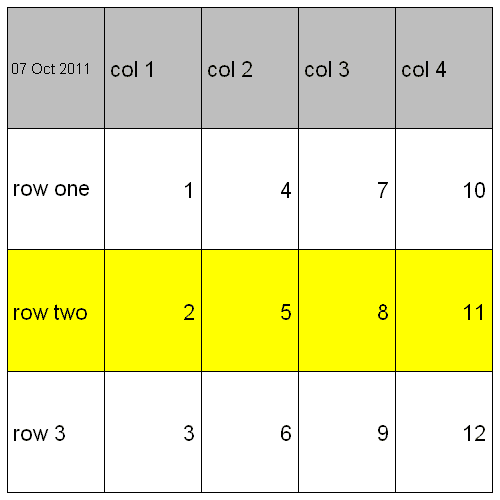
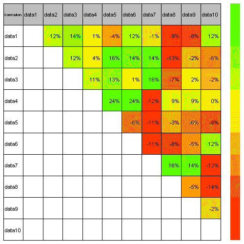
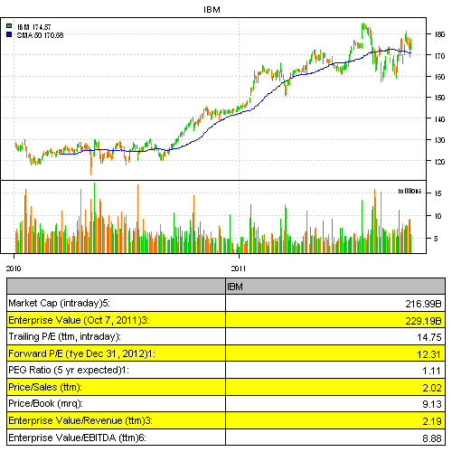

<!--yml
category: 未分类
date: 2024-05-18 14:48:54
-->

# Visualizing Tables with plot.table | Systematic Investor

> 来源：[https://systematicinvestor.wordpress.com/2011/10/07/visualizing-tables-with-plot-table/#0001-01-01](https://systematicinvestor.wordpress.com/2011/10/07/visualizing-tables-with-plot-table/#0001-01-01)

plot.table function in the Systematic Investor Toolbox is a flexible table drawing routine. plot.table has a simple interface and takes following parameters:

*   plot.matrix – matrix with data you want to plot
*   smain – text to draw in (top, left) cell; default value is blank string
*   highlight – Either TRUE/FALSE to indicate if you want to color each cell based on its numeric value Or a matrix with colors for each cell
*   colorbar – TRUE/FALSE flag to indicate if you want to draw colorbar

Here is a few examples how you can use plot.table function to create summary reports.

First, let’s load Systematic Investor Toolbox:

```

# load Systematic Investor Toolbox
setInternet2(TRUE)
source(gzcon(url('https://github.com/systematicinvestor/SIT/raw/master/sit.gz', 'rb')))

```

To create basic plot.table:

```

# define row and column titles
mrownames = spl('row one,row two,row 3')
mcolnames = spl('col 1,col 2,col 3,col 4')

# create temp matrix with data you want to plot
temp = matrix(NA, len(mrownames), len(mcolnames))
	rownames(temp) = mrownames
	colnames(temp) = mcolnames
	temp[,] = matrix(1:12,3,4)

# plot temp, display current date in (top, left) cell
plot.table(temp, format(as.Date(Sys.time()), '%d %b %Y'))

```

[](https://systematicinvestor.wordpress.com/wp-content/uploads/2011/10/plot1-small.png)

To create plot.table with colorbar:

```

# generate 1,000 random numbers from Normal(0,1) distribution
data =  matrix(rnorm(1000), nc=10)
	colnames(data) = paste('data', 1:10, sep='')

# compute Pearson correlation of data and format it nicely
temp = compute.cor(data, 'pearson')
	temp[] = plota.format(100 * temp, 0, '', '%')

# plot temp with colorbar, display Correlation in (top, left) cell
plot.table(temp, smain='Correlation', highlight = TRUE, colorbar = TRUE)

```

[](https://systematicinvestor.wordpress.com/wp-content/uploads/2011/10/plot2-small.png)

Next, I want to show a more practical example of plot.table function. I want to create a report page that will display a chart of IBM for 2010:2011 and a table with Valuation Measures from [Key Statistics Yahoo Finance webpage](http://finance.yahoo.com/q/ks?s=ibm).

```

# Load quantmod package to download price history for IBM
load.packages('quantmod')

Symbol = 'IBM'

# download IBM price history from Yahoo
data = getSymbols(Symbol, from = '1980-01-01', auto.assign = FALSE)

# download Key Statistics from yahoo
url = paste('http://finance.yahoo.com/q/ks?s=', Symbol, sep = '')
txt = join(readLines(url))

# extract Valuation Measures table from this page
temp = extract.table.from.webpage(txt, 'Market Cap', hasHeader = F)
	temp = rbind(c('', Symbol), temp)	# add header row

# prepare IBM data for 2010:2011 and compute 50 days moving average
y = data['2010::2011']
sma50 = SMA(Cl(y), 50)

# plote candles and volume and table
layout(c(1,1,2,3,3))

plota(y, type = 'candle', main = Symbol, plotX = F)
	plota.lines(sma50, col='blue')
	plota.legend(c(Symbol,'SMA 50'), 'green,blue', list(y,sma50))

y = plota.scale.volume(y)
plota(y, type = 'volume')

plot.table(temp)

```

[](https://systematicinvestor.wordpress.com/wp-content/uploads/2011/10/plot3-small.png)

I will show more examples of plot.table in the future posts.

To view the complete source code for this example, please have a look at the [plot.table.test() function in plot.table.r at github](https://github.com/systematicinvestor/SIT/blob/master/R/plot.table.r).