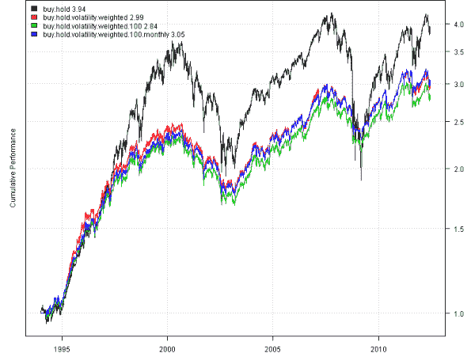
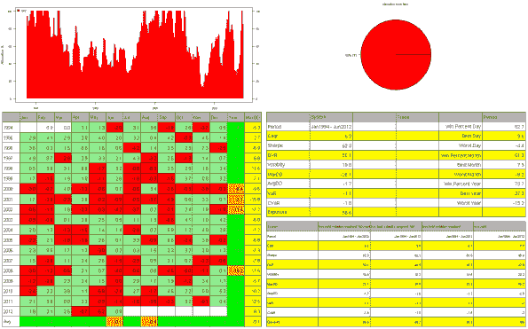
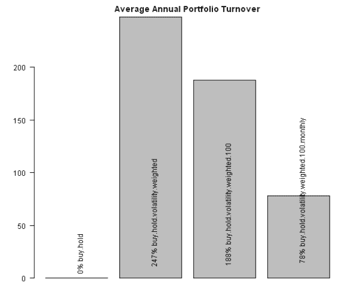
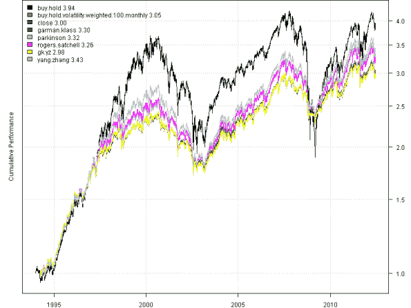
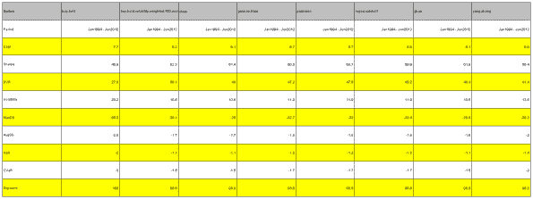
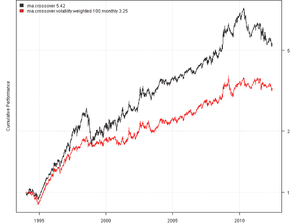
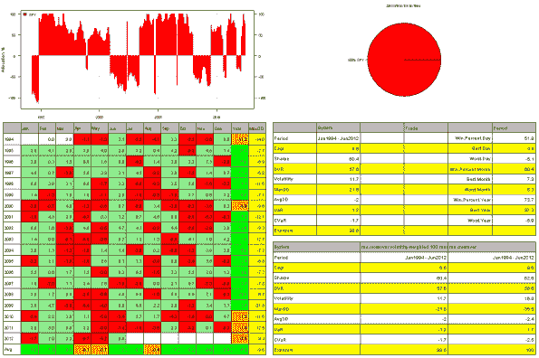
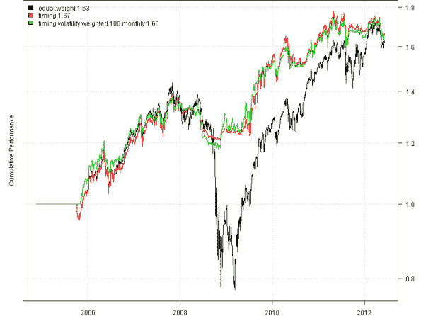
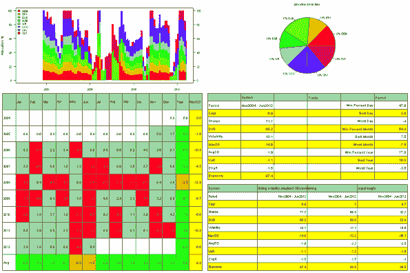

<!--yml
category: 未分类
date: 2024-05-18 14:40:15
-->

# Volatility Position Sizing 2 | Systematic Investor

> 来源：[https://systematicinvestor.wordpress.com/2012/06/12/volatility-position-sizing-2/#0001-01-01](https://systematicinvestor.wordpress.com/2012/06/12/volatility-position-sizing-2/#0001-01-01)

I have discussed Volatility Position Sizing in the [Volatility Position Sizing to improve Risk Adjusted Performance](https://systematicinvestor.wordpress.com/2012/05/01/volatility-position-sizing-to-improve-risk-adjusted-performance/) post using the [Average True Range (ATR)](http://stockcharts.com/school/doku.php?id=chart_school:technical_indicators:average_true_range_atr) as a measure of Volatility.

Today I want show how to use historical volatility to adjust portfolio leverage. Let’s start with Buy and Hold strategy using SPY and rescale it to the target volatility of 10%. I will use a 60 day rolling historical Volatility to adjust portfolio leverage in order to target 10% annual Volatility.

```

###############################################################################
# Load Systematic Investor Toolbox (SIT)
# https://systematicinvestor.wordpress.com/systematic-investor-toolbox/
###############################################################################
setInternet2(TRUE)
con = gzcon(url('http://www.systematicportfolio.com/sit.gz', 'rb'))
    source(con)
close(con)

	#*****************************************************************
	# Load historical data
	#****************************************************************** 
	load.packages('quantmod')	
	tickers = 'SPY'

	data <- new.env()
	getSymbols(tickers, src = 'yahoo', from = '1970-01-01', env = data, auto.assign = T)
		for(i in ls(data)) data[[i]] = adjustOHLC(data[[i]], use.Adjusted=T)		
	bt.prep(data, align='keep.all', dates='1994::')

	#*****************************************************************
	# Buy and Hold
	#****************************************************************** 
	prices = data$prices
	models = list()

	data$weight[] = 1
	models$buy.hold = bt.run.share(data, clean.signal=T)

	#*****************************************************************
	# Buy and Hold with target 10% Volatility
	#****************************************************************** 
	ret.log = bt.apply.matrix(data$prices, ROC, type='continuous')
	hist.vol = sqrt(252) * bt.apply.matrix(ret.log, runSD, n = 60)

	data$weight[] = 0.1 / hist.vol
	models$buy.hold.volatility.weighted = bt.run.share(data, clean.signal=T)

	#*****************************************************************
	# Buy and Hold with target 10% Volatility and Max Total leverage 100%
	#****************************************************************** 		
	data$weight[] = 0.1 / hist.vol
		rs = rowSums(data$weight)
		data$weight[] = data$weight / iif(rs > 1, rs, 1) 			
	models$buy.hold.volatility.weighted.100 = bt.run.share(data, clean.signal=T)

	#*****************************************************************
	# Same, rebalanced Monthly
	#****************************************************************** 
	period.ends = endpoints(prices, 'months')
		period.ends = period.ends[period.ends > 0]

	data$weight[] = NA
	data$weight[period.ends,] = 0.1 / hist.vol[period.ends,]
		rs = rowSums(data$weight[period.ends,])
		data$weight[period.ends,] = data$weight[period.ends,] / iif(rs > 1, rs, 1) 			
	models$buy.hold.volatility.weighted.100.monthly = bt.run.share(data, clean.signal=T)

	#*****************************************************************
	# Create Report
	#****************************************************************** 
	# Plot perfromance
	plotbt(models, plotX = T, log = 'y', LeftMargin = 3)	    	
		mtext('Cumulative Performance', side = 2, line = 1)

	plotbt.custom.report.part2(rev(models))

	# Plot Portfolio Turnover for each strategy
	layout(1)
	barplot.with.labels(sapply(models, compute.turnover, data), 'Average Annual Portfolio Turnover', plotX = F, label='both')

```

[](https://systematicinvestor.wordpress.com/wp-content/uploads/2012/06/plot1-small1.png)

[](https://systematicinvestor.wordpress.com/wp-content/uploads/2012/06/plot2-small1.png)

[](https://systematicinvestor.wordpress.com/wp-content/uploads/2012/06/plot3-small.png)

All strategies do a good job of rescaling portfolio leverage to the target 10% volatility.

Next let’s investigate other volatility measures. The volatility function in the [TTR](http://cran.r-project.org/web/packages/TTR/index.html) package includes following volatility calculation types:

*   Historical volatility
*   Garman and Klass
*   Parkinson
*   Rogers and Satchell
*   Garman and Klass – Yang and Zhang
*   Yang and Zhang

We can easily modify the algorithm above to use these different volatility calculations. One of my favorite sides of [R](http://www.r-project.org/) is that there is a function or package for anything you can imagine 🙂

```

	#*****************************************************************
	# Next let's examine other volatility measures
	#****************************************************************** 
	models = models[c('buy.hold' ,'buy.hold.volatility.weighted.100.monthly')]

	# TTR volatility calc types
	calc = c("close", "garman.klass", "parkinson", "rogers.satchell", "gk.yz", "yang.zhang")

	ohlc = OHLC(data$SPY)
	for(icalc in calc) {
		vol = volatility(ohlc, calc = icalc, n = 60, N = 252)

		data$weight[] = NA
		data$weight[period.ends,] = 0.1 / vol[period.ends,]
			rs = rowSums(data$weight[period.ends,])
			data$weight[period.ends,] = data$weight[period.ends,] / iif(rs > 1, rs, 1) 			
		models[[icalc]] = bt.run.share(data, clean.signal=T)
	}

	#*****************************************************************
	# Create Report
	#****************************************************************** 
	# Plot performance
	plotbt(models, plotX = T, log = 'y', LeftMargin = 3)	    	
		mtext('Cumulative Performance', side = 2, line = 1)

	plotbt.strategy.sidebyside(models)

```

[](https://systematicinvestor.wordpress.com/wp-content/uploads/2012/06/plot4-small.png)

[](https://systematicinvestor.wordpress.com/wp-content/uploads/2012/06/plot5-small.png)

The simple historical volatility does the best job at targeting volatility and controlling drawdowns.

Next let’s apply idea of Volatility Position Sizing to the strategy’s Equity Curve.

```

	#*****************************************************************
	# Volatility Position Sizing applied to MA cross-over strategy's Equity Curve
	#****************************************************************** 
	models = list()	

	sma.fast = SMA(prices, 50)
	sma.slow = SMA(prices, 200)
	weight = iif(sma.fast >= sma.slow, 1, -1)

	data$weight[] = weight
	models$ma.crossover = bt.run.share(data, clean.signal=T)

	#*****************************************************************
	# Target 10% Volatility
	#****************************************************************** 
	ret.log = bt.apply.matrix(models$ma.crossover$equity, ROC, type='continuous')
	hist.vol = sqrt(252) * bt.apply.matrix(ret.log, runSD, n = 60)

	data$weight[] = NA
		data$weight[period.ends,] = (0.1 / hist.vol[period.ends,]) * weight[period.ends,]
		# limit total leverage to 100%		
		rs = rowSums(data$weight[period.ends,])
		data$weight[period.ends,] = data$weight[period.ends,] / iif(abs(rs) > 1, abs(rs), 1) 			
	models$ma.crossover.volatility.weighted.100.monthly = bt.run.share(data, clean.signal=T)

	#*****************************************************************
	# Create Report
	#****************************************************************** 
	# Plot perfromance
	plotbt(models, plotX = T, log = 'y', LeftMargin = 3)	    	
		mtext('Cumulative Performance', side = 2, line = 1)

	plotbt.custom.report.part2(rev(models))

```

[](https://systematicinvestor.wordpress.com/wp-content/uploads/2012/06/plot6-small.png)

[](https://systematicinvestor.wordpress.com/wp-content/uploads/2012/06/plot7-small.png)

The Volatility Position Sizing does keep strategy’s volatility close to the target 10% volatility.

In the final example, I will apply Volatility Position Sizing to the Timing strategy developed by M. Faber

```

	#*****************************************************************
	# Apply Volatility Position Sizing Timing stretegy by M. Faber
	#****************************************************************** 
	tickers = spl('SPY,QQQ,EEM,IWM,EFA,TLT,IYR,GLD')

	data <- new.env()
	getSymbols(tickers, src = 'yahoo', from = '1970-01-01', env = data, auto.assign = T)
		for(i in ls(data)) data[[i]] = adjustOHLC(data[[i]], use.Adjusted=T)		
	bt.prep(data, align='remove.na', dates='1994::')

	#*****************************************************************
	# Code Strategies
	#****************************************************************** 
	prices = data$prices   
		n = ncol(prices)
	models = list()

	period.ends = endpoints(prices, 'months')
		period.ends = period.ends[period.ends > 0]

	#*****************************************************************
	# Equal Weight
	#****************************************************************** 
	data$weight[] = NA
		data$weight[period.ends,] = ntop(prices[period.ends,], n)
		data$weight[1:200,] = NA
	models$equal.weight = bt.run.share(data, clean.signal=F)

	#*****************************************************************
	# Timing by M. Faber
	#****************************************************************** 
	sma = bt.apply.matrix(prices, SMA, 200)

	weight = ntop(prices, n) * (prices > sma)
	data$weight[] = NA
		data$weight[period.ends,] = weight[period.ends,]
	models$timing = bt.run.share(data, clean.signal=F)

	#*****************************************************************
	# Timing with target 10% Volatility
	#****************************************************************** 
	ret.log = bt.apply.matrix(models$timing$equity, ROC, type='continuous')
	hist.vol = bt.apply.matrix(ret.log, runSD, n = 60)
		hist.vol = sqrt(252) * as.vector(hist.vol)

	data$weight[] = NA
		data$weight[period.ends,] = (0.1 / hist.vol[period.ends]) * weight[period.ends,]
		rs = rowSums(data$weight)
		data$weight[] = data$weight / iif(rs > 1, rs, 1) 				
		data$weight[1:200,] = NA
	models$timing.volatility.weighted.100.monthly = bt.run.share(data, clean.signal=T)

	#*****************************************************************
	# Create Report
	#****************************************************************** 
	# Plot perfromance
	plotbt(models, plotX = T, log = 'y', LeftMargin = 3)	    	
		mtext('Cumulative Performance', side = 2, line = 1)

	plotbt.custom.report.part2(rev(models))

```

[](https://systematicinvestor.wordpress.com/wp-content/uploads/2012/06/plot8-small.png)

[](https://systematicinvestor.wordpress.com/wp-content/uploads/2012/06/plot9-small.png)

Volatility Position Sizing is one of many Position Sizing algorithms that can be part of your money management rules. Let me what Position Sizing scheme works best for you.

To view the complete source code for this example, please have a look at the [bt.volatility.position.sizing.test() function in bt.test.r at github](https://github.com/systematicinvestor/SIT/blob/master/R/bt.test.r).