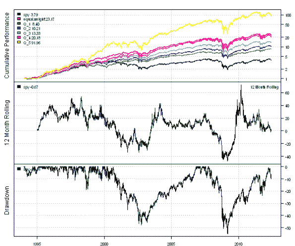
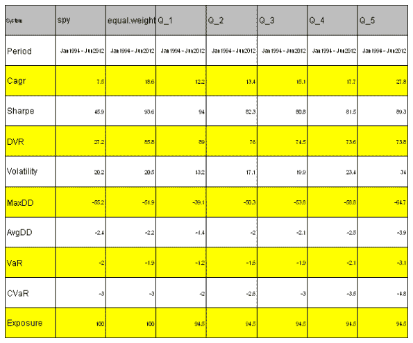

<!--yml
category: 未分类
date: 2024-05-18 14:40:23
-->

# Volatility Quantiles | Systematic Investor

> 来源：[https://systematicinvestor.wordpress.com/2012/06/05/volatility-quantiles/#0001-01-01](https://systematicinvestor.wordpress.com/2012/06/05/volatility-quantiles/#0001-01-01)

Today I want to examine the performance of stocks in the S&P 500 grouped into [Quantiles](http://en.wikipedia.org/wiki/Quantile) based on one year historical Volatility. The idea is very simple: each week we will form Volatility Quantiles portfolios by grouping stocks in the S&P 500 into Quantiles using one year historical Volatility. Next we will backtest each portfolio and check if low historical volatility corresponds to the low realized volatility.

Let’s start by loading historical prices for all companies in the S&P 500 and create SPY and Equal Weight benchmarks using the [Systematic Investor Toolbox](https://systematicinvestor.wordpress.com/systematic-investor-toolbox/):

```

###############################################################################
# Load Systematic Investor Toolbox (SIT)
# https://systematicinvestor.wordpress.com/systematic-investor-toolbox/
###############################################################################
con = gzcon(url('http://www.systematicportfolio.com/sit.gz', 'rb'))
    source(con)
close(con)

	#*****************************************************************
	# Load historical data
	#****************************************************************** 
	load.packages('quantmod')	
	tickers = sp500.components()$tickers

	data <- new.env()
	getSymbols(tickers, src = 'yahoo', from = '1970-01-01', env = data, auto.assign = T)
		# remove companies with less than 5 years of data
		rm.index = which( sapply(ls(data), function(x) nrow(data[[x]])) < 1000 )	
		rm(list=names(rm.index), envir=data)

		for(i in ls(data)) data[[i]] = adjustOHLC(data[[i]], use.Adjusted=T)		
	bt.prep(data, align='keep.all', dates='1994::')

	data.spy <- new.env()
	getSymbols('SPY', src = 'yahoo', from = '1970-01-01', env = data.spy, auto.assign = T)
	bt.prep(data.spy, align='keep.all', dates='1994::')

	#*****************************************************************
	# Code Strategies
	#****************************************************************** 
	prices = data$prices
		nperiods = nrow(prices)
		n = ncol(prices)

	models = list()

	# SPY
	data.spy$weight[] = NA
		data.spy$weight[] = 1
	models$spy = bt.run(data.spy)

	# Equal Weight
	data$weight[] = NA
		data$weight[] = ntop(prices, 500)
	models$equal.weight = bt.run(data)	

```

Next let’s divide stocks in the S&P 500 into Quantiles using one year historical Volatility and create backtest for each quantile.

```

	#*****************************************************************
	# Create Quantiles based on the historical one year volatility 
	#****************************************************************** 
	# setup re-balancing periods
	period.ends = endpoints(prices, 'weeks')
		period.ends = period.ends[period.ends > 0]

	# compute historical one year volatility
	p = bt.apply.matrix(coredata(prices), ifna.prev)	
	ret = p / mlag(p) - 1		
	sd252 = bt.apply.matrix(ret, runSD, 252)		

	# split stocks in the S&amp;P 500 into Quantiles using one year historical Volatility
	n.quantiles=5
	start.t = which(period.ends >= (252+2))[1]	
	quantiles = weights = p * NA

	for( t in start.t:len(period.ends) ) {
		i = period.ends[t]

		factor = sd252[i,]
		ranking = ceiling(n.quantiles * rank(factor, na.last = 'keep','first') / count(factor))

		quantiles[i,] = ranking
		weights[i,] = 1/tapply(rep(1,n), ranking, sum)[ranking]			
	}

	quantiles = ifna(quantiles,0)

	#*****************************************************************
	# Create backtest for each Quintile
	#****************************************************************** 
	for( i in 1:n.quantiles) {
		temp = weights * NA
		temp[period.ends,] = 0
		temp[quantiles == i] = weights[quantiles == i]

		data$weight[] = NA
			data$weight[] = temp
		models[[ paste('Q',i,sep='_') ]] = bt.run(data, silent = T)
	}

```

Finally let’s plot historical equity curves for each Volatility Quantile and create a summary table.

```

	#*****************************************************************
	# Create Report
	#****************************************************************** 					
	plotbt.custom.report.part1(models)		
	plotbt.strategy.sidebyside(models)

```

[](https://systematicinvestor.wordpress.com/wp-content/uploads/2012/06/plot1-small.png)

[](https://systematicinvestor.wordpress.com/wp-content/uploads/2012/06/plot2-small.png)

Our thesis is true for stocks in the S&P 500 index: low historical volatility leads to low realized volatility. There is a one-to-one correspondence between historical and realized volatility quantiles.

Please note that performance numbers have to be taken with a grain of salt because I used **current** components in the S&P 500 index; hence, introducing [survivorship bias](http://en.wikipedia.org/wiki/Survivorship_bias).

To view the complete source code for this example, please have a look at the [bt.volatility.quantiles.test() function in bt.test.r at github](https://github.com/systematicinvestor/SIT/blob/master/R/bt.test.r).